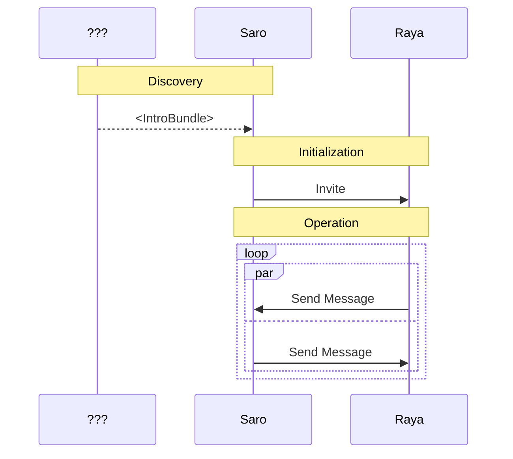

# Abstract

This specification defines a modular communication protocol framework for describing chat protocols. It introduces abstraction boundaries, and a component model for describing chat protocol functionality.

# Background / Rationale / Motivation

Chat protocols specifications can be long and dense documents. To fully describe a chat protocol there are many layers and operations which are required to be documented. This includes payloads, message transport, encryption as well as user level features such as account registration, typing indicators, content formatting.

With the vast amount of information required to maintain compatibility between applications - protocol documentation is either comprehensive which leads to large monolithic specifications or lacking the required details for interop between implementors.

# Theory / Semantics

This specification defines a abstract framework for building a chat protocol. Its purpose is to name the components, and define modular boundaries between components to promote reuse. The end result is that a chat protocol implementation can be described by listing its approach to 5 problem areas.

The chat protocol is be decomposed into 3 distinct phases.

- **Discovery:** How does a Sender learn of other clients.
- **Initialization:** How does a Recipient learn a client wants to communicate with them.
- **Operation:** How do participants exchange content.

and transport details are divided into:

- **Delivery Service:** How are payloads are routed and delivered to a client.
- **Framing Strategy:** How are payloads encoded.

Defining these 5 parameters allows for chat protocol implementations to be fully defined, which allows clients from different applications to exchange messages.

## Abstract Transport

### Delivery service

A Delivery Service (DS) is the service or method that distributes payloads to clients. A DS accepts payloads with a delivery_address and delivers them to all subscribers of that delivery_address. Protocols use delivery_addresses to establish delivery contracts between senders and recipients. The mapping of delivery_addresses to DS-level concepts is implementation-specific.

#### Requirements

- -A DS MUST provide a method for clients to subscribe to messages from a delivery_address
- Payloads sent to a delivery_address are delivered by a DS to all subscribers of that delivery_address
- A DS MAY NOT guarantee message delivery
- A DS MAY NOT guarantee message ordering

### Framing Strategy

In this protocol framework, payloads from multiple protocols are potentially multiplexed over the same channel. This requires that clients are able to associate a given payload to a given instance of a protocol. 

A framing strategy should define a common payload type as well as a method to determine which state machine a receiving client must used to decode it.

## Protocol Components

In order to exchange content clients must be able to learn of each others existence, gather the pre-requisite information/parameters and, remain synchronized over time.

The lifecycle of a protocol instance is divided into three phases, which are described by a corresponding protocol.

- **Discovery Phase:** Discovery Protocol
- **Initialization Phase:** Initialization Protocol
- **Operation Phase:** Conversation Protocol

### Discovery Protocol

A discovery protocol defines how clients gather the prerequisite information to contact another client. 

The input requirements of the discovery protocol are not defined here, and largely determined by the desired user experience.

The output requirements of the discovery protocol are very implementation specific, and will depend on the initialization protocol requirements and DS chosen by the implementation. The data provided by the discovery protocol and required by the initialization protocol is called the `IntroductionBundle`. 

- The discovery protocol MUST provide all data required for the initialization protocol.

Note: There is no requirement that the Discovery protocol be a complicated nor interactive process. Hypothetically If all required values to construct a IntroductionBundle could be statically defined, that would be sufficient for this definition.

### Initialization Protocol

A initialization protocol specifies how two clients can initiate communication. The input to this process is the `IntroductionBundle` and the output is an established instance of a `Conversation` between the participants.

The core of an initialization protocol is a defined location and procedure for receiving initial messages.

Many chat protocols choose to define the initialization protocol within the conversation protocol. This tight coupling produces two negative artifacts. 
- New conversation protocols must define and deploy there own initialization channels. Increasing overhead and adding complexity.
- New protocol upgrades then create partitions in the communication network, as older clients have no means of communicating with new clients.

Separating channel initialization from conversation flow allows multiple conversations to reuse the same initialization channel. This reduces effort for new conversation protocols, and is especially valuable when upgrading existing ones. Being independent the initialization pathway can persist across conversation versions. Even if an older client cannot parse new message types, it can still recognize their presence, adding observability. 

### Conversation Protocol 

A conversation protocol defines how messages flow between participants, and subsequently determines the properties of that channel.

- A Conversation protocol MUST define the payloads it uses and how to handle them.
- A Conversation protocol SHOULD outline the cryptographic properties provided
- A Conversation protocol SHOULD describe bidirectional communication.
- A Conversation protocol ...

## Copyright

Copyright and related rights waived via [CC0](https://creativecommons.org/publicdomain/zero/1.0/).

## References

A list of references.
