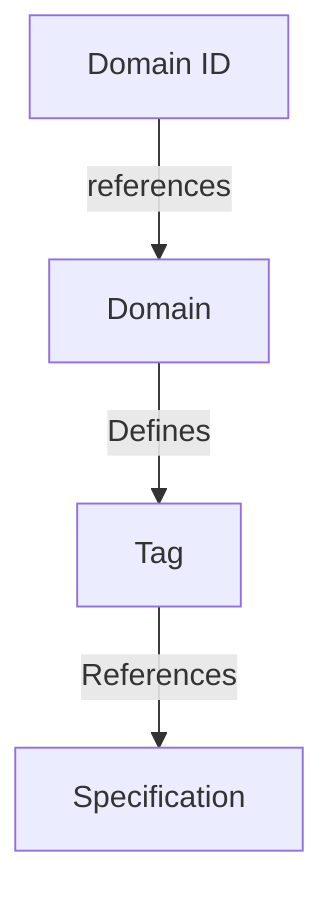

## Abstract


## Background / Rationale / Motivation

Application developers use chat protocols to send payloads between clients. However not all payloads sent over a protocol are intended to be read by the end users. In normal operation a chat protocol needs to notify the chat clients of event changes in order to keep all clients synchronized. With a finite set of message types, its possible to explicitly label each type as "content" or "meta-message" and route the payload appropriately. In an evolving decentralized chat protocol, this is not alway possible. When a client receives a payload it does not understand, there exists an ambiguity of whether this message contains a payload intended for the application, or a protocol message type which it does not understand. This ambiguity makes versioning between clients difficult. 

Furthermore as applications communicating with each other cannot be guaranteed to be compatible, its possible that applications can receive messages and be uncertain as how to parse incoming messages.

Having a mechanism that removes the ambiguity of how to handle payloads intended for end users is beneficial for both clients and applications.

## Theory / Semantics

### Definitions

This document makes use of the shared terminology defined in the [CHATDEFS]() protocol.

[Payload, Application, client]

### ContentFrame

A ContentFrame is used to describe messages intended to be consumed by applications/end users. 

The presence of a ContentFrame declares a payload ought to be passed to the application, and its fields describe how to parse the attached payload. This decouples the encoded data from the software that created by including the required context.

When sending and receiving payloads:

- All payloads created at the application level MUST be wrapped in a ContentFrame.
- All payloads wrapped in a ContentFrame SHOULD be passed to the application.
- Unhandled non-ContentFrames MUST NOT be passed to the application.


### Concept Mapping




### Domain

A domain defines the authority which governs a set of content types. It cannot be assumed that all specifications covering content types reside in the same location or are governed by the same entity. By including the `domain` receiving application developers can determine where the definition of the type resides, regardless of where it originated.

- A domain MUST be a valid URL as defined in [RFC 3986](https://datatracker.ietf.org/doc/html/rfc3986).
- A domain MUST contain definitions for its content types.
- A domain SHOULD be a repository or index of specifications.

To reduce payload size, domains are mapped to an integer `domain_id`. The mappings can be found [here](#appendix-a-domains)

- a domain_id MUST be a positive integer value
- a domain_id MUST correspond to a single unique domain

### Tag

A tag uniquely defines a type within a domain. After parsing the Domain and the tag application developers have all the data required to process the payload. Each domain is responsible for managing its tags and providing documentation to developers on how the corresponding types are used.
 
- A tag MUST correspond to a single unique type within a domain.
- A tag MUST 
- Two payloads with the same `tag` MUST correspond to the same type.

A domain MAY choose how tags are mapped to types, 

 

## Wire Format Specification / Syntax

```protobuf
message ContentFrame {
    uint32 domain_id = 1;
    uint32 tag = 2;
    bytes bytes = 3;
}
```

**domain_id:** This field contains an integer which identifies the domain of this type.
**tag:** This field contains an integer which identifies which type `bytes` contains.
**bytes:** This field contains the encoded payload. 


## Implementation Suggestions (optional)

### Tags -> Specifications

If possible the integer tag values should be the same as the specification which defines the type used. While not necessary, using the specification id directly removes the requirement to maintain a separate mapping of tag -> specification. 

### Fragmentation

This protocol allows for multiple competing definitions of similar content types. Having multiple definitions of a `TextMessage` or `Image` will increase fragmentation between applications. Where possible reusing existing types will reduce burden on app developers, and increase interoperability between apps.

Domains should focus on providing types unique to their service or usecase.

### Tag Selection

New types SHOULD be allocated the next available tag within a domain. Choosing larger values will needlessly increase payload size.


## Security/Privacy Considerations

The privacy and security properties are inherited by the protocol used to transmit these payloads.


# Appendix A: Domains
**TODO:** 
- Find appropriate home for this.

Domain ID's are provided on a first come first serve basis.


- A domain MUST only appear once in the table

| domain_id |  specification repository |
|-----------|-------------------------------------|
| 0         |   https://github.com/waku-org/specs |   