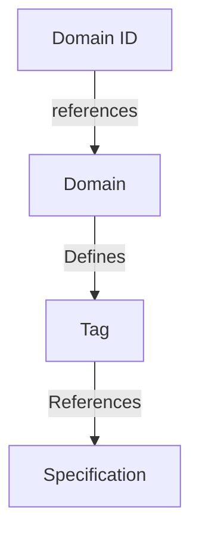

## Abstract

This specification defines ContentFrame, a self-describing message format for decentralized chat networks.
ContentFrame wraps content payloads with metadata identifying their type and governing specification repository.
Using a `(domain, tag)` tuple, applications can uniquely identify message types and locate authoritative documentation for parsing unfamiliar content.
This approach enables permissionless innovation while maintaining the context needed for interoperability, allowing applications to gracefully handle messages from sources they don't explicitly know about.

## Motivation

In an interoperable chat network, participants cannot be assumed to use the same software to send and receive messages.
Users may employ different versions of the same application or different applications entirely.
This heterogeneity creates a fundamental challenge: how can applications support extensible message types without prior knowledge of every possible format?

Two naive approaches each have significant drawbacks:

**Developer-defined types** would allow flexibility but create fragmentation.
When developers define their own message types, the context for parsing these messages remains tightly coupled to the software that created them.
Other applications receiving these messages lack the necessary context to interpret them correctly.
This leads to multiple definitions of basic types such as `Text` and `Image` that are not compatible across applications.

**Fixed type systems** would ensure universal understanding but restrict innovation.
A predetermined set of message types eliminates ambiguity but adds friction for developers who want to extend functionality.
In a permissionless, decentralized protocol, requiring centralized approval for new message types contradicts core design principles.

The core challenge is managing fragmentation in a decentralized protocol while preserving developer freedom to innovate.

**Solution:** A self-describing message format that encodes both the payload and the metadata needed to parse it.
This approach directs application developers on how a message should be parsed while providing a clear path to learn about unfamiliar content types they encounter.
By decoupling the encoded data from the specific software that created it, applications can gracefully handle messages from diverse sources without sacrificing extensibility.


## Theory / Semantics

### ContentFrame

A ContentFrame provides a self-describing format for payload types by encoding both the type identifier and its administrative origin.
The core principle is that each payload should declare which entity is responsible for its definition and provide a unique type discriminator within that entity's namespace.

A ContentFrame consists of two key components:

- **Domain**: Points to a specification repository that defines and governs a collection of types
- **Tag**: A unique identifier within that domain that specifies which type the payload conforms to

Together, the tuple `(domain, tag)` serves two purposes:

1. **Identification**: Uniquely identifies the payload type without ambiguity
2. **Discovery**: Provides a path for developers to learn how to parse and support unfamiliar types

**Benefits:**

This approach provides several advantages for decentralized interoperability:

- **No naming collisions**: Developers can independently create types without coordinating with others, as each domain manages its own namespace
- **Type reuse**: Well-defined, established types can be shared across applications, reducing fragmentation
- **Graceful extensibility**: Applications encountering unknown types can direct developers to the authoritative specification
- **Decentralized governance**: No central authority is required to approve new types; domains manage their own specifications

By separating the "who defines this" (domain) from the "what is this" (tag), ContentFrame enables permissionless innovation while maintaining the context needed for interoperability.


### Concept Mapping

The following diagram illustrates the relationship between ContentFrame components and their specifications:


### Domain

A domain identifies the authority responsible for defining and governing a set of content types.
By including the domain, receiving applications can locate the authoritative specification for a type, regardless of which application originally sent it.

**Requirements:**

- A domain MUST be a valid URL as defined in [RFC 3986](https://datatracker.ietf.org/doc/html/rfc3986)
- A domain MUST host or reference definitions for all content types within its namespace
- A domain SHOULD be a specification repository or index that developers can reference

**Specification Format:**

Domains are responsible for describing their types in whatever format is most appropriate.
The only requirement is that the information needed to parse and understand each type is accessible from the domain URL.


**Domain ID Mapping:**

To minimize payload size, domains are mapped to integer identifiers.
Each domain is assigned a unique `domain_id` which is used in the wire format instead of the full URL.

- A `domain_id` MUST be a positive integer value
- A `domain_id` MUST correspond to exactly one unique domain
- The canonical mapping of `domain_id` to domains can be found in [Appendix A: Domains](#appendix-a-domains)

### Tag

A tag is a numeric identifier that uniquely specifies a content type within a domain's namespace.
After resolving the domain and tag, application developers have all the information needed to locate the definition and parse the payload.

**Requirements:**

- A tag MUST be a positive integer value
- A tag MUST uniquely identify a single type within its domain
- Two payloads with the same `(domain, tag)` tuple MUST conform to the same type specification
- A tag's meaning MUST NOT change after it has been assigned within a domain

**Domain Responsibility:**

Each domain is responsible for:
- Assigning and managing tag values within its namespace
- Documenting how each tag maps to a type specification
- Ensuring tag assignments remain stable and unambiguous

Tags are scoped to their domain, meaning the same tag value can represent different types in different domains without conflict.

 

## Wire Format Specification / Syntax
```protobuf
message ContentFrame {
    uint32 domain_id = 1;
    uint32 tag = 2;
    bytes payload = 3;
}
```

**Field Descriptions:**

- **domain_id**: Identifies the domain that governs this content type
- **tag**: Identifies the specific content type within the domain's namespace
- **payload**: The encoded content data

All fields are required.


## Implementation Suggestions

### Tags to Specifications

Where possible, tag values should directly correspond to specification identifiers.
Using specification IDs as tags removes the need to maintain a separate mapping between tags and specifications.

### Fragmentation

This protocol allows multiple competing definitions of similar content types.
Having multiple definitions of `Text` or `Image` increases fragmentation between applications.
Where possible, reusing existing types will reduce burden on developers and increase interoperability.

Domains should focus on providing types unique to their service or use case.


# Appendix A: Domains

![TODO] Find appropriate home for this registry.

Domain IDs are assigned sequentially on a first-come, first-served basis.
New domains are added via pull request.

**Registry Rules:**

- A domain MUST only appear once in the table
- A domain MAY be updated by the original submitter if the repository has been moved

**Registry:**

| domain_id | specification repository             |
|-----------|--------------------------------------|
| 0         | https://github.com/waku-org/specs    |