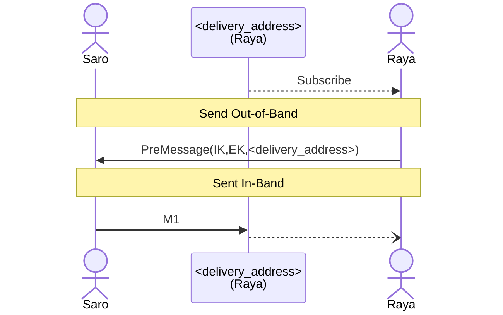

# Abstract


# Background / Rationale / Motivation

Communication protocols often face a fundamental bootstrapping problem: how can two parties establish secure, authenticated communication when they lack trusted channels? Traditional centralized approaches rely on servers to deliver invitations using pre-agreed upon encryption mechanisms. 

In a decentralized context, this problem is more pronounced as participants cannot rely on an external service to help navigate version mismatches and client routing. Senders must know where participants are listening for messages and how to encode messages. Clients running older versions of the protocol are not able to interoperate with newer protocol versions which can fragment the network during upgrades.


## Design goals


# Theory / Semantics

## Definitions

This document makes use of the shared terminology defined in the [CHATDEFS]() protocol.
[Sender, Recipient, invite, OutOfBand]

## Inbox

Inboxes are a mechanism for a client to receive messages from others which it does not share a channel with. 
They are inbound only method to exchange payloads with a client. Its most direct application is to enable the reception of invites to other communication channels.

They provide :
 - Payload Confidentiality: Only the participants can read the contents of any message sent.
 - Content Integrity: Recipients can detect if the contents were modified by a third party.
 - Sender Privacy: Only the recipient can determine who the sender was.
 - Mutual Authentication: All participants are confident of who the participants are
 - Forward Secrecy: A compromise in the future does not allow previous messages to be decrypted by a third party.

### Message Flow

- Recipient subscribes to a `delivery_address`.
- Recipient and Sender exchange the required data out of band.
- Sender sends message to the `deliver_address` encrypted for the recipient.




### Message Routing

This protocol assumes that a delivery service is used to transport messages. To facilitate the delivery of messages this protocol introduces the concept of a `delivery address`. The `delivery address` is an abstraction of the identifier used to route messages in the delivery service of choice. Clients subscribe to a delivery address, in order to receive message the set of messages sent to that address. While messages are not

- Messages sent to a `delivery address` MAY not be delivered to a subscribed client.
- Messages sent to a `delivery address` MAY arrive out of order
- All clients subscribed to the same `delivery address` MUST receive the same set of messages under normal operation.
- Clients subscribed to a `delivery address` MAY receive message 
- A subscription to a  `delivery address` MAY include messages intended for other subscribers.

`Senders` must know in advance the `delivery_address` which a client is subscribed to. How this occurs is out-of-scope of this specification.

# Encryption

## Preamble

### Keys
Each participant has two keys:
- **InstallationKey (IK):** Longterm static key which identifies an instance of a client.
- **EphemeralKey (EK):** Single use key for added security.


## Pre-messages 

As a prerequiste to establishing a secure channel, the `sender` must know the `recipients` InstallationKey and EphemeralKey

How these are transfer is out of scope for this protocol.


## Key Exchange

Inbox messages are encrypted using a variant of the KX noise handshake. 

```
KX:
  -> s
  ...
  -> e
  <- e, ee, se, s, es
```

To maintain asynchronicity of the key exchange the Noise:initiators ephemeral key is sent as a pre-message along with the initiators long term secret. 


A equivalent way of writing this using noise handshake notation would be: 

```
XK0:
  <- s
  <- e
  ...
  -> e, ee, es, s, se  
```
In this notation the noise roles have been swapped so that the noise initiator aligns with the protocols definitions of a `Sender`. 


## Ciphersuite

The noise handshake is implemented with the following functions:

DH: X25519 cipher: AEAD_CHACHA20_POLY1305 hash: BLAKE2b

## Recipient Key Identifer 
Recipients need to know which ephemeral public key was used in the senders noise handshake. To communicate this, senders include a short identifier for the key. 

Calculated as: `blake2b('WAP|{K})`[0..4]

Where 
- `K` is the publicKey encoded acccording to [section 5](https://datatracker.ietf.org/doc/html/rfc7748#section-5) of rfc7748

[TODO] The key Identifier is sent unencrypted and thus can be used to link sent payloads to an existing set of participants if the channel used to distribute the pre-messages was compromised. At the moment it needs to be transmitted it is possible to compute `es` which would mean the information could be encrypted prior to transport with modification to the handshake.

## Validation

- Clients MUST ensure that ephemeral keys are used at most once.
- Once a ephemeral key has been used recipients must discard all future messages attempting to use that key.

## Wire Format Specification / Syntax

The wire format is specified using protocol buffers v3.

### Encryption Wrapper
```protobuf
message NoiseXK0 {
    bytes ephemeral = 1;
    bytes key_ref = 2; 
    bytes static = 3;       //Encrypted
    bytes payload = 4;
}
```
Message provides the required parameters for a recipient to decrypt a message using the XK0 handshake pattern.

- **ephemeral:** This field contains the remotes ephemeral public key. 
- **key_ref:** This field contains the recipient key identifier used in the handshake. This value is 4 bytes long. 
- **static:** this field contains the remotes static public key. This value is encrypted according to the noise protocol to hide the senders identity.
- **payload:** This field contains an encrypted protobuf encoded InboxV1Frame containing the encrypted payload. 


### Inbox Frame
```protobuf
message InboxV1Frame {
    int64 timestamp = 1;
    oneof frame_type {
        invite.InvitePrivateV1 invite_private_v1 = 10;
    }
}
```
This message 


## Implementation Suggestions (optional)

Recipients ephemeral key is not signed, and is susceptible to tampering by an active attacker during transit out of band. Implementors SHOULD keep the number of valid keys as little as possible. Revoking keys after a defined period of time, and only generating keys when needed minimizes the ability for an attacker to substitute weak keys

### Delivery Address

Implementors should be mindful when choosing a scheme for assigning delivery addresses to an inbox as this will have direct impact on client scalability. Clients will receive all messages for a delivery address, which increases the number of messages that clients will have to process.


## Security/Privacy Considerations

Ephemeral key signing


- Weak forward secrecy attack - Ephemeral keys can be chosen by a malicious actor
- Privacy Concern - Ephemeral key binding


Recipient Ephemeral keys are considered identifying information. Anyone knowing the ephemeral key, will be able to link the pre-message to the first message on the wire. Note: When pre-messages are sent publicly or intercepted by a attacker, the security properties remain intact. 


## References

[rfc7748](https://datatracker.ietf.org/doc/html/rfc7748#section-5)


## Copyright

Copyright and related rights waived via [CC0](https://creativecommons.org/publicdomain/zero/1.0/).


