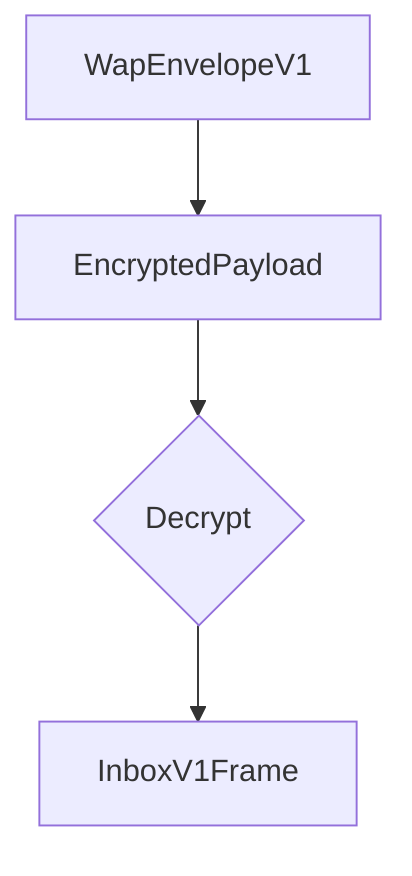

# Abstract

An Inbox is a declaration of where a client is listening for messages, and the protocol for sending them.

# Background / Rationale / Motivation

Communication protocols often face a fundamental bootstrapping problem: how can two parties establish secure, authenticated communication when they lack trusted channels?
Traditional centralized approaches rely on servers to deliver invitations using pre-agreed upon encryption mechanisms. 
This process requires servers to know the recipient's identity so messages can be delivered which leaks metadata.  

In a decentralized context, there are no centralized servers to handle delivery, so senders must know where clients are listening for messages. 
Protocols have traditionally opted for a static location, which forces the protocol to choose a one-size-fits-all solution when there are inherent trade-offs between privacy and resource usage. 

# Theory / Semantics

Inboxes are a standardized, receive-only communication primitive that serves as a secure entry point for initial contact establishment. 
Inboxes define where entities can safely receive connection requests, invitations, and introductory messages independent of more complex protocols.

From a usage perspective, inboxes have several unique properties:
- There is no assumption of exclusive usage, many clients can use the same inbox - though they will ignore messages addressed to others.
- There is no associated keypair, messages are encrypted to existing identities, using the defined encryption mechanism.
- There is no restriction on how many inboxes a client can have (cardinality unbounded). 
- Developers/Contributors can determine which contacts learn of an inbox.

## Parameters 

To define an inbox, the following parameters must be set:
- **inbox_address:** a string value of length >=1. This value ought to be considered visible to observers. 

## Summary

ConversationId: `/convo/inbox/v1/<client_address>`
ContentTopic: `lower_hex(blake2s("/inbox/<inbox_address>"))`
Encryption: `NoiseKNfallback`
Encoding: protobuf3

## Invitations / Initialization

Inboxes do not require coordination with other clients to be initialized. Subscribing to messages is sufficient.

Clients ultimately need to notify contacts that the inbox exists in order to receive messages, however this is the responsibility of developers/contributors.

## Content Topic Usage

The content topic that is used is defined by `lower_hex(blake2s("/inbox/<inbox_address>"))`. 

The hash function does not provide privacy in this context as an observer can always enumerate inbox_addresses and unmask, because of this it's recommended that inbox_addresses be secret if recipient privacy is desired. 

## Conversation Id

Messages sent to the inbox MUST use the conversation_id = `/convo/inbox/v1/<client_address>` where `client_address` is the defined address for the Identity you are trying to reach. 

## Accepted types
Inboxes are intended to receive frames and invites from other Conversation types. They are not intended to receive content or arbitrary frames, as not all clients would know how to decode these. 
To maintain interoperability each ConversationType is required to define valid payloads for Inboxes.

Older clients may be unable to process newer messages. 
Sending clients SHOULD determine what conversation types the receiving client supports, however a mechanism is not provided here.

## Encryption

All Frames sent to the Inbox MUST be encrypted to maintain message confidentiality. 

This protocol uses a reversed variant of the [KN noise handshake](https://noiseexplorer.com/patterns/KN/) to secure inbound messages.

 ```noise
KNfallback:
  <- e, s
  ...
  -> e, ee, es	
 ```

In this case the recipient provides both `s` and `e` out of band. 

The handshake’s primary purpose is to provide sender confidentiality, with some forward secrecy. 
The handshake is similar to a one way N handshake with a recipient side ephemeral key.   

Note that this channel does not provide sender authentication, and should only be used to implement a confidential message delivery with some forward secrecy.
This tradeoff is intentional to maintain O-RTT encryption. As this is an inbound pathway further messages to establish mutual authentication with identity hiding would be wasteful. 

### Ciphersuite

The noise handshake is implemented with the following functions:

**DH:** X25519
**cipher:** AEAD_CHACHA20_POLY1305 
**hash:** BLAKE2s 

The noise protocol name would then be `Noise_KNfallback_25519_ChaChaPoly_BLAKE2s`

This protocol opts for 32bit platform optimized variants(where possible) to reduce overhead in mobile and resource constrained environments.

### Endianness

[TODO: The Noiseprotocol specification recommends BigEndian length fields - Need to define if this protocol will deviate]

## Framing 


### EncryptedPayload

The EncryptedPayload message is a self-describing wrapper for all encrypted payloads. 
This message type makes no assumptions about the encryption used and allows new conversation types to use the same messaging framework.

As this protocol uses the KN noise handshake, the encoding wrapper uses the corresponding type. 

## Wire Format Specification / Syntax

The wire format is specified using protocol buffers v3.

```protobuf

message InboxV1Frame {
    string recipient = 1;
    oneof frame_type {
        ... supported invite types
    }
}

message EncryptedPayload {

    oneof encryption {
		NoiseKN noise_KN = 1;
    }
   
    message NoiseKN {
        bytes encrypted_bytes = 1;
        bytes ephemeral_pubkey = 2;
    }
}

```

## Security/Privacy Considerations

### Sender Authentication

The encryption scheme used does not provide any sender authentication. 
Messages sent over this pathway need to validate the sender before trusting any of the contents.

### EncryptedPayload metadata leakage

Encrypted bytes themselves are not encrypted so its fields are visible to all observers. 
Through analytical means observers can determine the type of message being sent, by looking at what fields are present, and the relative size of the payload. 
This is true regardless of whether the encrypted bytes are wrapped in a EncryptedPayload object. 
Wrapping the payload allows for better support into the future without meaningfully changing the metadata leakage. 

## Copyright

Copyright and related rights waived via [CC0](https://creativecommons.org/publicdomain/zero/1.0/).


## References

A list of references.
