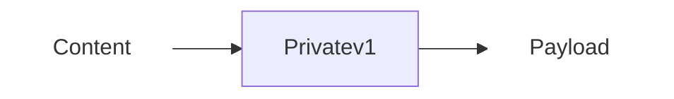
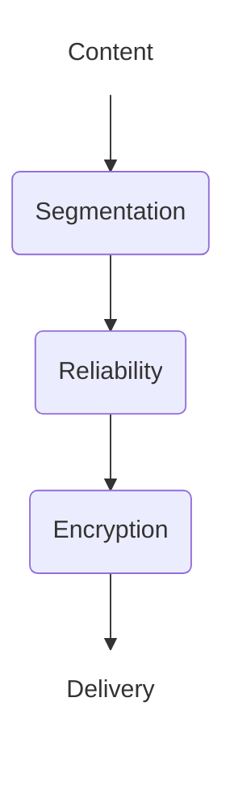
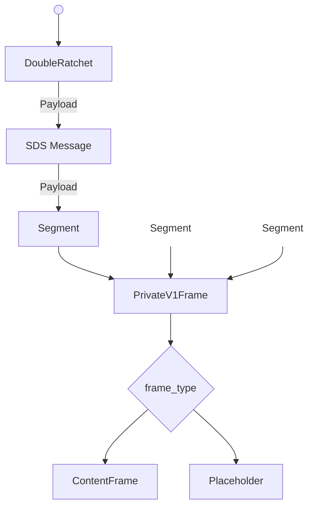

# Abstract


# Background

Pairwise encrypted messaging channels are a foundational component in building chat systems. They allow for confidential, authenticated payloads to be delivered between two clients. Groupchats an more conversation based communication often rely on pairwise channels (at least partially) to deliver state updates and coordination messages. 

Having robust pairwise communication channels allow for 1:1 communication while also providing the infrastructure for more complicated communication.

# Private V1

PrivateV1 is conversation type which establishes a full-duplex secure channel between two participants.

Private Conversations have the following properties:
 - Payload Confidentiality: Only the participants can read the contents of any message sent.
 - Content Integrity: Recipients can detect if the contents were modified by a third party.
 - Sender Privacy: Only the recipient can determine who the sender was.
 - Forward Secrecy: A compromise in the future does not allow previous messages to be decrypted by a third party.
 - Post Compromise Security: Conversations eventually recover from a compromise which occurs today.
 - Message Reliablity: Messages sent with this protocol are 
 - Partial Message Order: !TODO: 

## Definitions

This document makes use of the shared terminology defined in the [CHAT-DEFINITIONS](https://github.com/waku-org/specs/blob/jazzz/chatdefs/informational/chatdefs.md) specification.

The terms include:
- Recipient
- Sender
- Payload
- Content
- Participant
- Application


## Architecture

This conversation type assumes there is some service or application which wishes to generate and receive encrypted content. It also assumes that some other component will be responsible for delivering the generated payloads. How messages are sent are to be determined by implementors.



### Application
Responsible for the creation and generation of content. 

### Delivery Service
This protocols assumes there is a abstract delivery service which is responsible for routing payloads to their destination. See: [TODO](link.to.spec).

## Initialization

Prior to operation participants MUST agree on the following parameters fopr each conversation. 
- `rda` - delivery address (recipient)
- `sda` - delivery address (sender)
- `sk` - initial secret key  [32 bytes]

To maintain the security properties `sk`:
- MUST be known only by the participants.
- MUST be mutually authenticated.  

Additionally implementations MUST determine the following constants:
- `max_seg_size` - maximum segmentation size.
- `max_skip` - number of keys which can be skipped per session.

## Operation

There are 3 phases to operation.




- **Segmentation**: Divides contents into smaller fragments for transportation. 
- **Reliability**: Adds tracking information to detect dropped messages.
- **Encryption**: 

The output of each phase of the operational pipeline is the input of the next.

### Segmentation
This protocol places no restriction on the size of the content to be delivered. In order to support restrictions of any delivery service messages are segmented to a predefined size.

The segmentation strategy used is defined by [!TODO: Flatten link once completed](https://github.com/waku-org/specs/pull/91)

!TODO: ^Spec currently has a limit of 

### Message Reliability
Scalable Data Sync is used to detect missing messages and provide delivery receipts to the sender after successful reception of a payload.
SDS is implementated according to the [specification](https://github.com/vacp2p/rfc-index/blob/3505da6bd66d2830e5711deb0b5c2b4de9212a4d/vac/raw/sds.md).


!TODO: define: sender_id mapping
!TODO: define: message_id mapping
!TODO: update to latest version and inlcude SDS-R

!NOTE: The defaultConfig in nim-SDS creates a bloom filter with the parameters n=10000, p=0.001 which has a size of ~18KiB. The bloom filter is included in every message which results in a bestcase overhead rate of 13.3% (assuming waku's MSS of 150KB).  Given a target content size of 4KB, that puts the utilization factor at 80+% (Without considering other layers). This needs to be looked at, lowering to n=2000 would lower overhead to ~3.5 KiB.

### Encryption

Payloads are encrypted using [doubleratchet](https://signal.org/docs/specifications/doubleratchet/).

With the following choices for external fucntions:
- `DH`: X25519
- `KDF_RF`: HKDF with SHA256, info = "logoschat_privatev1"
- `KDF_CK`: HKDF with SHA256, input = "0x01 for message key, and "0x02" for chainkey
- `KDF_MK`: HKDF with SHA256, hdkf.info = "PrivateV1MessageKey"
- `ENCRYPT`: Implemented with AEAD_CHACHA20_POLY1305

!TODO: Define AssociatedData

AEAD_CHACHA20_POLY1305 is implemented using randomly generated nonces. The nonce and tag are combined with the ciphertext for transport where `ciphertext = nonce || encrypted_bytes || tag`.


# Wire Format Specification / Syntax

## Payload Parse Tree

A deterministic parse tree is used to avoid ambiguity when recieving payloads.


!TODO: Replace placeholder 


## Payloads
!TODO: Don't duplicate payload definitions from other specs. Though its helpful for now.

### Encrypted Payload
```protobuf
message Doubleratchet {
    bytes dh = 1;               // 32 byte publickey
    uint32 msgNum = 2;          
    uint32 prevChainLen = 3;     
    bytes ciphertext = 4;       // arbitrary length bytes
}
```
**dh**: the x component of the dh_pair.publickey encoded as raw bytes. 
**ciphertext**: A protobuf encoded SDS Message

### SDS Message

This payload is used without modification from the SDS Spec.

```protobuf
message HistoryEntry {
    string message_id = 1;        
    bytes retrieval_hint = 2;                      
  }
  
message ReliablePayload {
    string message_id = 2;      
    string channel_id = 3;  
    int32 lamport_timestamp = 10;    
    repeated HistoryEntry causal_history = 11;   
    bytes bloom_filter = 12; 
    bytes content = 20;                           
  }
```

**content:** This field is an protobuf encoded `Segment`

!TODO: Why is SDS using signed int for timestamps?

### Segmentation 

This payload is used without modification form the Segmentation [specification](https://github.com/waku-org/specs/blob/fa2993b427f12796356a232c54be75814fac5d98/standards/application/segmentation.md)

```proto

message SegmentMessageProto {
  bytes  entire_message_hash    = 1; // 32 Bytes
  uint32 index                  = 2; 
  uint32 segments_count         = 3;
  bytes  payload                = 4; 
  uint32 parity_segment_index   = 5;
  uint32 parity_segments_count  = 6; 
}

```

**payload**: This field is an protobuf encoded `PrivateV1Frame`

### Frame

```protobuf
message PrivateV1Frame {                 
    uint64 timestamp = 3;             // Sender reported timestamp
	oneof frame_type {
		common_frames.ContentFrame content = 10;
        Placeholder placeholder = 11;
        // ....
	}
}
```


## Implementation Suggestions
An *implementation suggestions* section may provide suggestions on how to approach implementation details,
as well as more context an implementer may need to be aware off when proceeding with the implementation.

if available, point to existing implementations for reference.


## (Further Optional Sections)


## Security/Privacy Considerations

### Segmentation Session Binding 


### Privacy - ContentSize


## Copyright

Copyright and related rights waived via [CC0](https://creativecommons.org/publicdomain/zero/1.0/).

## References

A list of references.