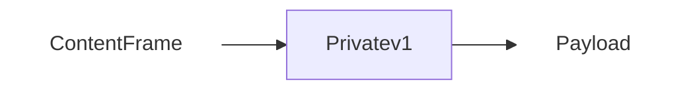
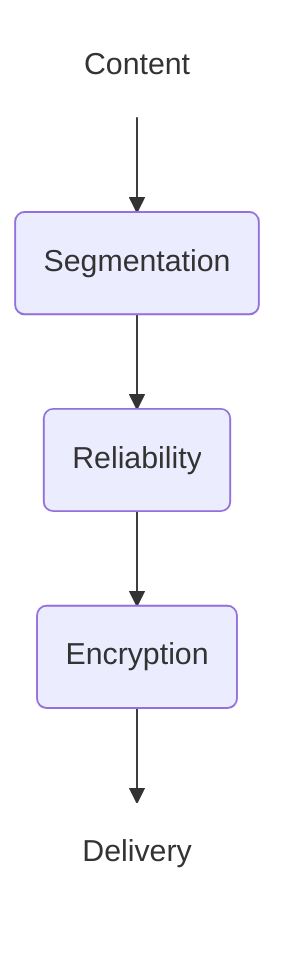
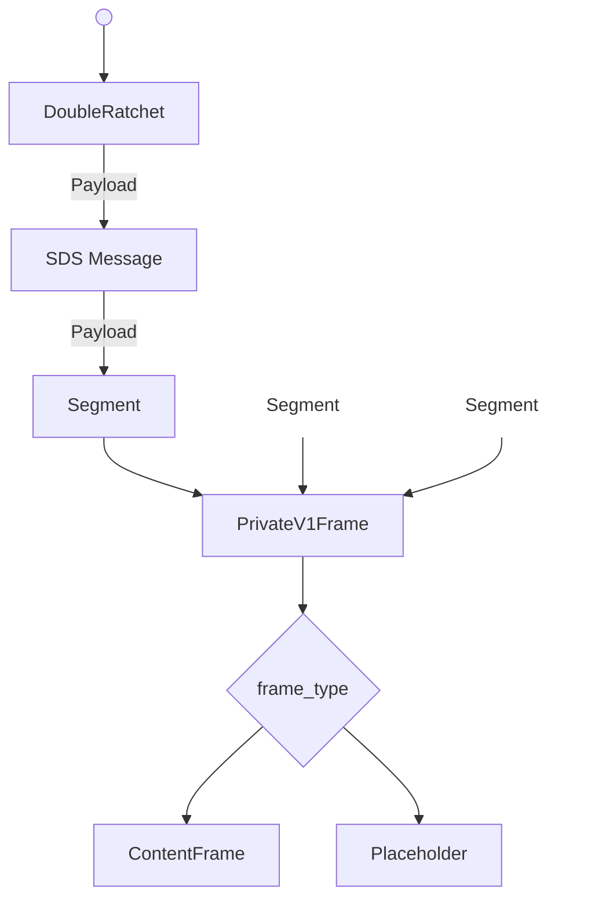

# Abstract


# Background

Pairwise encrypted messaging channels are a foundational component in building chat systems. They allow for confidential, authenticated payloads to be delivered between two clients. Groupchats and channel based communication often rely on pairwise channels (at least partially) to deliver state updates and coordination messages. 

Having robust pairwise communication channels allow for 1:1 communication while also providing the infrastructure for more complicated communication.

# Private V1

PrivateV1 is conversation type which establishes a full-duplex secure channel between two participants.

Private Conversations have the following properties:
 - Payload Confidentiality: Only the participants can read the contents of any message sent.
 - Content Integrity: Recipients can detect if the contents were modified by a third party.
 - Sender Privacy: Only the recipient can determine who the sender was.
 - Forward Secrecy: A compromise in the future does not allow previous messages to be decrypted by a third party.
 - Post Compromise Security: Conversations eventually recover from a compromise which occurs today.
 - Message Reliability: Messages sent with this protocol are 
 - Partial Message Order: !TODO: 

## Definitions

This document makes use of the shared terminology defined in the [CHAT-DEFINITIONS](https://github.com/waku-org/specs/blob/jazzz/chatdefs/informational/chatdefs.md) specification.

The terms include:
- Application
- Content
- Participant
- Payload
- Recipient
- Sender


## Architecture

This conversation type assumes there is some service or application which wishes to generate and receive encrypted content. 
It also assumes that some other component will be responsible for delivering the generated payloads. 



### Payload Delivery
How payloads are sent and received by clients is not described in this protocol. 
The choice of delivery method has no impact on the security of this conversation type, though the choice may affect sender privacy and censorship resistance. 
In practice, any best-effort method of transmitting payloads will suffice, as no assumptions are made.

### Content 
This protocol expects that all content be wrapped in a ContentFrame as per [CONTENTFRAME](https://github.com/waku-org/specs/blob/jazzz/content_frame/standards/application/contentframe.md) specification. 

This increases observability when issues arise due to client versions mismatches. By enforcing that only ContentFrames will be passed to applications, this creates a clear boundary between Content and protocol owned meta messages.  

## Initialization

The channel is initialized by both sender and recipient agreeing on the following values for each conversation:
- `sk` - initial secret key  [32 bytes]
- `ssk` - sender DH seed key
- `rsk` - recipient DH seed key
- `rda` - delivery address (recipient) !TODO: Can delivery addresses be removed from this spec?
- `sda` - delivery address (sender)


To maintain the security properties:
- `sk` MUST be known only by the participants.
- `sk` MUST be derived in a way that ensures mutual authentication of the participants
- `sk` SHOULD have forward secrecy by incorporating ephemeral key material 
- `rsk` and `ssk` SHOULD incorporate ephemeral key material

Additionally implementations MUST determine the following constants:
- `max_seg_size` - maximum segmentation size to be used.
- `max_skip` - number of keys which can be skipped per session. Values are determined by 

## Frame Encoding

There are 3 phases to operation.




- **Segmentation**: Divides contents into smaller fragments for transportation. 
- **Reliability**: Adds tracking information to detect dropped messages.
- **Encryption**: Provides confidentiality and tamper resistance.

The output of each phase of the operational pipeline is the input of the next.

### Segmentation
Thought the protocol has no limitation, it is assumed that a delivery mechanism MAY have restrictions on the max message size. 
While this is a transport level issue, it's included here because deferring segmentation has negative impacts on bandwidth efficiency and privacy. 
Forcing the transport layer to handle segmentation would require either reassembling unauthenticated segments (which are open to malicious interference) or implementing encryption at the transport layer.
In the event of a dropped payload, segmentation after reliability would require clients to re-broadcast entire frames, rather than only the missing segments. 
This unnecessarily increases load on the network/clients and increases a DOS attack surface. 
To optimize the entire pipeline, segmentation is handled first, so that segments can benefit from the reliability and robust encryption already in place.

The segmentation strategy used is defined by [!TODO: Flatten link once completed](https://github.com/waku-org/specs/pull/91)

Implementation specifics:
- Error correction is not used, as reliable delivery is already provided by lower layers. 
- `segmentSize` = `max_seg_size` 
!TODO: ^Spec currently has a limit of 

### Message Reliability
Scalable Data Sync is used to detect missing messages and provide delivery receipts to the sender after successful reception of a payload.
SDS is implemented according to the [specification](https://github.com/vacp2p/rfc-index/blob/3505da6bd66d2830e5711deb0b5c2b4de9212a4d/vac/raw/sds.md).

!TODO: define: sender_id mapping
!TODO: define: message_id mapping
!TODO: update to latest version and include SDS-R

!NOTE: The defaultConfig in nim-SDS creates a bloom filter with the parameters n=10000, p=0.001 which has a size of ~18KiB. The bloom filter is included in every message which results in a best-case overhead rate of 13.3% (assuming waku's MSS of 150KB).  Given a target content size of 4KB, that puts the utilization factor at 80+% (Without considering other layers). This needs to be looked at, lowering to n=2000 would lower overhead to ~3.5 KiB.

### Encryption

Payloads are encrypted using [`doubleratchet`](https://signal.org/docs/specifications/doubleratchet/).

With the following choices for external functions:
- `DH`: X25519
- `KDF_RF`: HKDF with SHA256, info = `logoschat_privatev1`
- `KDF_CK`: HKDF with SHA256, input = "0x01 for message_key, and "0x02" for chain_key
- `KDF_MK`: HKDF with SHA256, hdkf.info = "PrivateV1MessageKey"
- `ENCRYPT`: Implemented with AEAD_CHACHA20_POLY1305

!TODO: Define AssociatedData

AEAD_CHACHA20_POLY1305 is implemented using randomly generated nonces. The nonce and tag are combined with the ciphertext for transport where `ciphertext = nonce || encrypted_bytes || tag`.


## Frame Handling

This protocol uses explicit tagging of content, to remove ambiguity when parsing/handling frames. 
This allows for clear distinction between content and frames providing protocol functionality. Even if new frames are added in the future, Clients can be certain whether the payload is intended for itself or applications. This is achieved through an invariant - All non-content frames are intended to be consumed by the client. When a new unknown frame arrives it can be certain that a version compatibility issue has occurred. 

- Clients SHALL only pass content frames to Applications
- Clients MAY drop unrecognized frames 


# Wire Format Specification / Syntax

## Payload Parse Tree

A deterministic parse tree is used to avoid ambiguity when receiving payloads.


!TODO: Replace placeholder 


## Payloads
!TODO: Don't duplicate payload definitions from other specs. Though its helpful for now.

### Encrypted Payload
```protobuf
message Doubleratchet {
    bytes dh = 1;               // 32 byte publickey
    uint32 msgNum = 2;          
    uint32 prevChainLen = 3;     
    bytes ciphertext = 4;       // arbitrary length bytes
}
```
**dh**: the x component of the dh_pair.publickey encoded as raw bytes. 
**ciphertext**: A protobuf encoded SDS Message

### SDS Message

This payload is used without modification from the SDS Spec.

```protobuf
message HistoryEntry {
    string message_id = 1;        
    bytes retrieval_hint = 2;                      
  }
  
message ReliablePayload {
    string message_id = 2;      
    string channel_id = 3;  
    int32 lamport_timestamp = 10;    
    repeated HistoryEntry causal_history = 11;   
    bytes bloom_filter = 12; 
    bytes content = 20;                           
  }
```

**content:** This field is an protobuf encoded `Segment`

!TODO: Why is SDS using signed int for timestamps?

### Segmentation 

This payload is used without modification from the Segmentation [specification](https://github.com/waku-org/specs/blob/fa2993b427f12796356a232c54be75814fac5d98/standards/application/segmentation.md)

```protobuf

message SegmentMessageProto {
  bytes  entire_message_hash    = 1; // 32 Bytes
  uint32 index                  = 2; 
  uint32 segments_count         = 3;
  bytes  payload                = 4; 
  uint32 parity_segment_index   = 5;
  uint32 parity_segments_count  = 6; 
}

```

**payload**: This field is an protobuf encoded `PrivateV1Frame`

!TODO: This should be encoded as a FrameType so it can be optional.

### Frame

```protobuf
message PrivateV1Frame {                 
    uint64 timestamp = 3;             // Sender reported timestamp
	oneof frame_type {
		common_frames.ContentFrame content = 10;
        Placeholder placeholder = 11;
        // ....
	}
}
```

!TODO: This is the only place where this protocol is explicitly dependent on ContentFrame. 
A concept of a content tagging is required, but the exact structure could be a implementation detail. How best to abstract the exact type away?


## Implementation Suggestions

### Initialization

Mutual authentication is provided by the `sk`, so there is no requirement of using authenticated keys for `ssk` and `rsk`. Implementations SHOULD use the most ephemeral key available in order incorporate as much key material as possible. This means that senders SHOULD generate a new ephemeral key for `ssk` for every conversation assuming channels are asynchronously initialized.

### Excessive Skipped Message 

Handling of skipped message keys is not strictly defined in double ratchet. Implementations need to choose an strategy which works best for their environment, and delivery mechanism. Halting operation of the channel is the safest, as it bounds resource utilization in the event of a DOS attack but is not always possible.  

If eventual delivery of messages is not guaranteed, implementors should regularly delete keys that are older than a given time window. Unreliable delivery mechanisms will result in increased key storage over time, as more messages are lost with no hope of delivery. 

!TODO: Worth making deletion of stale keys part of the spec?

## Security/Privacy Considerations

### Sender Derivation


### Segmentation Session Binding 


### Privacy - ContentSize


## Copyright

Copyright and related rights waived via [CC0](https://creativecommons.org/publicdomain/zero/1.0/).

## References

A list of references. use SHA256 or SAH256.