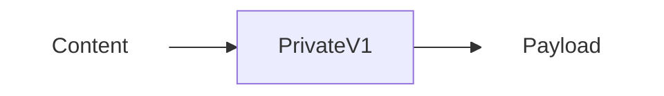
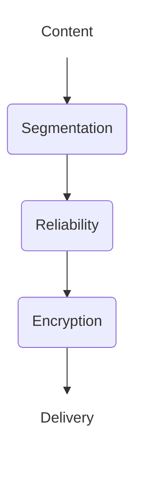
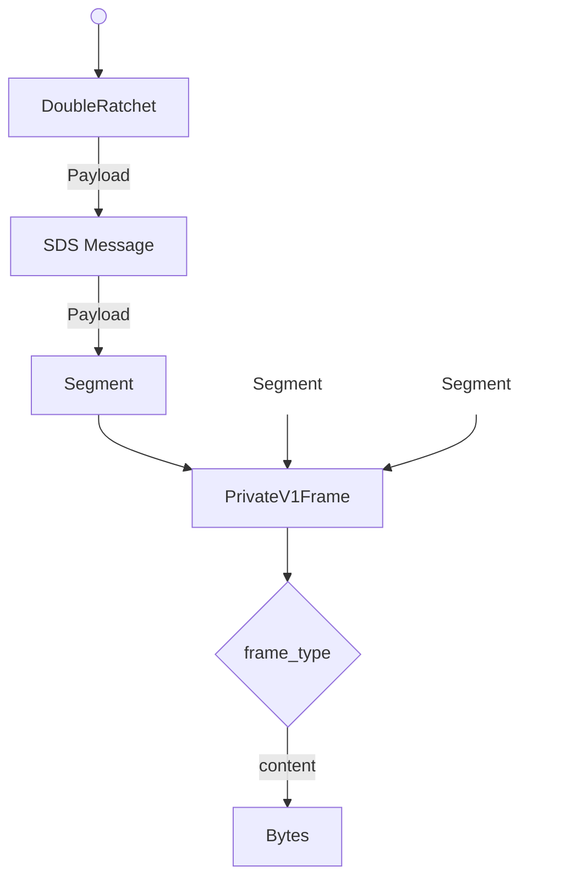

# Abstract

This specification defines PRIVATE1, a conversation protocol for establishing secure, full-duplex encrypted communication channels between two participants. PRIVATE1 provides end-to-end encryption with forward secrecy and post-compromise security using the Double Ratchet algorithm, combined with reliable message delivery via Scalable Data Sync (SDS) and efficient segmentation for transport-constrained environments.

The protocol is transport-agnostic and designed to support both direct messaging and as a foundation for group communication systems. PRIVATE1 ensures payload confidentiality, content integrity, sender privacy, and message reliability while remaining resilient to network disruptions and message reordering.

# Background

Pairwise encrypted messaging channels represent a foundational building block of modern secure communication systems. While end-to-end encrypted group chats capture user attention, the underlying infrastructure that makes these systems possible relies (at least somewhat) on secure one-to-one communication primitives. Just as higher-level network protocols are built upon reliable transport primitives like TCP, sophisticated communication systems depend on robust pairwise channels to function correctly and securely.

These channels serve purposes beyond simple content delivery. They transmit not only user-visible messages but also critical metadata, coordination signals, and state synchronization information between clients. This signaling capability makes pairwise channels essential infrastructure for distributed systems: key material distribution, membership updates, administrative actions, and protocol coordination all flow through these channels. While more sophisticated group communication strategies can achieve better efficiency at scale—particularly for broadcast-style communication patterns — they struggle to match the privacy and security properties that pairwise channels provide inherently. The fundamental asymmetry of two-party communication enables stronger guarantees: minimal metadata exposure, simpler key management, clearer authentication boundaries, and more straightforward security analysis.

However, being encrypted is merely the starting point, not the complete solution. Production-quality one-to-one channels must function reliably in the messy reality of modern networks. Real-world deployment demands resilience to unreliable networks where messages may be lost, delayed, duplicated, or arrive out of order. Channels must efficiently handle arbitrarily large payloads—from short text messages to multi-megabyte file transfers—while respecting the maximum transmission unit constraints imposed by various transport layers. Perhaps most critically, the protocol must remain fully operational even when one or more participants are offline or intermittently connected. 


# Private V1

PRIVATE1 is a conversation type specification that establishes a full-duplex secure communication channel between two participants. It combines the Double Ratchet algorithm for encryption with Scalable Data Sync (SDS) for reliable delivery and an efficient segmentation strategy to handle transport constraints. 

PRIVATE1 provides the following properties:

- **Payload Confidentiality**: Only the two participants can read the contents of any message sent. Observers, transport providers, and other third parties cannot decrypt message contents.
- **Content Integrity**: Recipients can detect if message contents were modified by a third party. Any tampering with encrypted payloads will cause decryption to fail, preventing corrupted messages from being accepted as authentic.
- **Sender Privacy**: Only the recipient can determine who the sender was. Observers cannot identify the sender from encrypted payloads, though both participants can authenticate each other's messages.
- **Forward Secrecy**: A compromise in the future does not allow previous messages to be decrypted by a third party. Message keys are deleted immediately after use and cannot be reconstructed from current state, even if long-term keys are later compromised.
- **Post-Compromise Security**: Conversations eventually recover from a key compromise. After an attacker loses access to a device, the security properties are eventually restored.
- **Dropped Message Observability**: Messages lost in transit are eventually observable to both sender and recipient. 

## Definitions

This document makes use of the shared terminology defined in the [CHAT-DEFINITIONS](https://github.com/waku-org/specs/blob/jazzz/chatdefs/informational/chatdefs.md) specification.

The terms include:
- Application
- Content
- Participant
- Payload
- Recipient
- Sender


## Architecture

This conversation type assumes there is some service or application which wishes to generate and receive end-to-end encrypted content. 
It also assumes that some other component is responsible for delivering the generated payloads. At its core this protocol takes the content provided and creates a series of payloads to be sent to the recipient.


### Content

Applications provide content as encoded bytes, which is then packaged into payloads for transmission.

**Size Limit**

Content MUST be smaller than `255 * max_seg_size`
due to segmentation protocol limitations.

**Structure**

The protocol treats the contents as an arbitrary sequence of bytes and is agnostic to its contents.

### Payload Delivery
How payloads are sent and received by clients is deliberately not specified by this protocol.
Transport choice is an implementation decision that should be made based on deployment requirements.

The choice of transport mechanism has no impact on PRIVATE1's security properties.
Confidentiality, integrity, and forward secrecy are provided regardless of how payloads are delivered.
However, transport choice may affect other properties and characteristics.

**Recipient Privacy:** 
The routing/addressing layer may leak sensitive metadata including the recipient's identity. The payloads generated by this protocol do not reveal the participants of a conversation, however the overall privacy properties are determined by the delivery mechanism used to transport payloads. 

**Reliability Performance**
While PRIVATE1 handles message losses, more reliable transports reduce retransmission overhead. 

## Initialization

The channel is initialized by both sender and recipient agreeing on the following values for each conversation:
- `sk` - initial secret key  [32 bytes]
- `ssk` - sender DH seed key
- `rsk` - recipient DH seed key
- `conversation_id` - globally unique identifier

To maintain the security properties:
- `sk` MUST be known only by the participants.
- `sk` MUST be derived in a way that ensures mutual authentication of the participants
- `sk` SHOULD have forward secrecy by incorporating ephemeral key material 
- `rsk` and `ssk` SHOULD incorporate ephemeral key material

PRIVATE1 requires a unique identifier, however the exact derivation is left to implementations to determine.
- `conversation_id` MUST be unique across all instances of chat conversations
- `conversation_id` SHOULD be consistent across applications to maintain interoperability

Additionally implementations MUST determine the following constants:
- `max_seg_size` - maximum segmentation size to be used.
- `max_skip` - number of keys which can be skipped per session.

## Value Derivations

These values are derived during protocol operation and are deterministically computed from protocol data.

### Frame Identifier

For reliability tracking, every payload MUST have a unique deterministic identifier.

The frame identifier is computed as:
```
frame_id = rhex(blake2b(encoded_frame_bytes))
```

Where:
- `rhex` is lowercase hexadecimal encoding without the `0x` prefix
- `blake2b` is BLAKE2b hash function with 128-bit output
- `encoded_frame_bytes` is the protobuf-encoded `PrivateV1Frame`
- `frame_id` is a 32 character string

**Protobuf Encoding Considerations**

Protobuf does not guarantee byte-identical outputs for multiple serializations of the same logical message.
Because of this, the `frame_id` represents the hash of specific encoded bytes rather than an abstract frame structure.
Implementations MUST compute `frame_id` from the actual bytes being transmitted to ensure sender and receiver derive identical identifiers.


## Protocol Operation

PRIVATE1 processes messages through a three-stage pipeline where each stage's output becomes the next stage's input.
The specific ordering of these stages is critical for maintaining security properties while enabling efficient operation.


**Pipeline Stages:**
- **Segmentation**: Divides content into transport-appropriate fragments
- **Reliability (SDS)**: Adds tracking metadata for delivery detection and ordering
- **Encryption (Double Ratchet)**: Provides confidentiality, authentication, and forward secrecy


### Segmentation

While PRIVATE1 itself has no inherent message size limitation, practical transport mechanisms typically impose maximum payload sizes.

**Why Segment Before Encryption**

Segmenting after encryption would force the transport layer to handle fragmentation of ciphertext blobs, creating several problems.
- Transport-layer segmentation would require buffering all segments before any can be authenticated, increasing the DOS attack surface.
- Unauthenticated segment reassembly opens the door to malicious segment injection and substitution attacks.
- Unencrypted segmentation metadata reveals size and other metadata about the content in transit. 

**Why Segment Before Reliability**

Placing segmentation after reliability tracking would mean retransmission of a dropped segment would require re-broadcasting the entire frame.
By segmenting first, the reliability layer can track individual segments and request retransmission of only the missing fragments.

**Implementation**

The segmentation strategy used is defined by [!TODO: Flatten link once completed](https://github.com/waku-org/specs/pull/91)

Implementation specifics:
- Error correction is not used, as reliable delivery is already provided by lower layers. 
- `segmentSize` = `max_seg_size`
- All payloads regardless of size are wrapped in a segmentation message.
 
### Message Reliability

Scalable Data Sync (SDS) is used to detect missing messages, provide delivery confirmation, and handle retransmission of payloads.
SDS is implemented according to the [specification](https://github.com/vacp2p/rfc-index/blob/main/vac/raw/sds.md).

**SDS Field Mappings**

The following mappings connect PRIVATE1 concepts to SDS fields:

- `sender_id`: !TODO: This requires PRIVATE1 to be identity aware
- `message_id`: uses the `frame_id` definition. 
- `channel_id`: uses the `conversation_id` parameter.

**Sender Validation**
SDS uses a `sender_id` payload field to determine whether a message was sent by the remote party. This value is sender reported and not validated which can have unknown implications if trusted in other contexts. For security hygiene Clients SHOULD drop SDS messages if `sender_id` != the sender derived from the encryption layer. !TODO: PRIVATE1 is not sender aware currently

**Bloom Filter Configuration**

PRIVATE1 uses bloom filter parameters of `n=2000` (expected elements) and `p=0.001` (false positive probability).
This configuration produces bloom filters of approximately 3.5 KiB per message.

!TODO: Can the bloom filter be dropped in 1:1 communication?

### Encryption

Payloads are encrypted using the [Double Ratchet](https://signal.org/docs/specifications/doubleratchet/) algorithm with the following cryptographic primitive choices:

**Double Ratchet Configuration**

- `DH`: X25519 for Diffie-Hellman operations
- `KDF_RK`: HKDF with BLAKE2b, `info = "PrivateV1RootKey"`
- `KDF_CK`: HKDF with BLAKE2b, using `input`=`0x01` for message keys and `input`=`0x02` for chain keys
- `KDF_MK`: HKDF with BLAKE2b, `info = "PrivateV1MessageKey"`
- `ENCRYPT`: `AEAD_CHACHA20_POLY1305`

**AEAD Implementation**

`ChaCha20-Poly1305` is used with randomly generated 96-bit (12-byte) nonces.
The nonce MUST be generated using a cryptographically secure random number generator for each message.
The complete ciphertext format for transport is:
```
encrypted_payload = nonce || ciphertext || tag
```

Where `nonce` is 12 bytes, `ciphertext` is variable length, and `tag` is 16 bytes.

## Frame Handling

This protocol uses explicit frame type tagging to remove ambiguity when parsing and handling frames.
This creates a clear distinction between protocol-generated frames and application content.

**Type Discrimination**

All frames carry an explicit type field that identifies their purpose.
The `content` frame type is reserved exclusively for application-level data.
All other frame types are protocol-owned and intended for client processing, not application consumption.

This establishes a critical invariant: any frame that is not `content` is meant for the protocol layer.
When a client encounters an unknown frame type, it can definitively conclude this represents a version compatibility issue.

**Processing Rules**

- All application-level content MUST use the `content` frame type
- Clients SHALL only pass `content` frames to applications
- Clients MAY drop unrecognized frame types

**Future Extensibility**

This explicit tagging mechanism allows the protocol to evolve without breaking existing implementations.
Future versions may define additional frame types for protocol-level functionality while legacy clients continue processing `content` frames normally.

# Wire Format Specification / Syntax

## Payload Parse Tree

A deterministic parse tree is used to avoid ambiguity when receiving payloads.




## Payloads
!TODO: Don't duplicate payload definitions from other specs. Though its helpful for now.

### Encrypted Payload
```protobuf
message DoubleRatchet {
    bytes dh = 1;               // 32 byte publickey
    uint32 msgNum = 2;          
    uint32 prevChainLen = 3;     
    bytes ciphertext = 4;       // arbitrary length bytes
}
```
**dh**: the x component of the dh_pair.publickey encoded as raw bytes. 
**ciphertext**: A protobuf encoded SDS Message

### SDS Message

This payload is used without modification from the SDS Spec.

```protobuf
message HistoryEntry {
  string message_id = 1;                // Unique identifier of the SDS message, as defined in `Message`
  optional bytes retrieval_hint = 2;    // Optional information to help remote parties retrieve this SDS message; For example, A Waku deterministic message hash or routing payload hash
}

message Message {
  string sender_id = 1;           // Participant ID of the message sender
  string message_id = 2;          // Unique identifier of the message
  string channel_id = 3;          // Identifier of the channel to which the message belongs
  optional int32 lamport_timestamp = 10;    // Logical timestamp for causal ordering in channel
  repeated HistoryEntry causal_history = 11;  // List of preceding message IDs that this message causally depends on. Generally 2 or 3 message IDs are included.
  optional bytes bloom_filter = 12;         // Bloom filter representing received message IDs in channel
  optional bytes content = 20;             // Actual content of the message
}
```

**content:** This field is a protobuf encoded `Segment`

### Segmentation 

This payload is used without modification from the Segmentation [specification](https://github.com/waku-org/specs/blob/fa2993b427f12796356a232c54be75814fac5d98/standards/application/segmentation.md)

```protobuf

message SegmentMessageProto {
  bytes  entire_message_hash    = 1; // 32 Bytes
  uint32 index                  = 2; 
  uint32 segments_count         = 3;
  bytes  payload                = 4; 
  uint32 parity_segment_index   = 5;
  uint32 parity_segments_count  = 6; 
}

```

**payload**: This field is an protobuf encoded `PrivateV1Frame`

!TODO: This should be encoded as a FrameType so it can be optional.

### PrivateV1Frame

```protobuf
message PrivateV1Frame {                 
    uint64 timestamp = 1;             // Sender reported timestamp
	oneof frame_type {
		bytes content = 10;
        Placeholder placeholder = 11;
        // ....
	}
}
```

**content:** is encoded as bytes in order to allow implementations to define the type at runtime. 


## Implementation Suggestions

### Content Types

Implementers need to be mindful of maintaining interoperability between clients, when deciding how content is encoded prior to transmission.
In a decentralized context, clients cannot be assumed to be using the same version let alone application. It is recommended that implementers use a self-describing content payload such as [CONTENTFRAME](https://github.com/waku-org/specs/blob/jazzz/content_frame/standards/application/contentframe.md) specification. This provides the ability for clients to determine support for incoming frames, regardless of the software used to receive them. 

### Initialization

Mutual authentication is provided by the `sk`, so there is no requirement of using authenticated keys for `ssk` and `rsk`. 
Implementations SHOULD use the most ephemeral key available in order incorporate as much key material as possible. 
This means that senders SHOULD generate a new ephemeral key for `ssk` for every conversation assuming channels are asynchronously initialized.

### Excessive Skipped Message 

Handling of skipped message keys is not strictly defined in double ratchet. 
Implementations need to choose a strategy which works best for their environment, and delivery mechanism. 
Halting operation of the channel is the safest, as it bounds resource utilization in the event of a DOS attack but is not always possible.  

If eventual delivery of messages is not guaranteed, implementers should regularly delete keys that are older than a given time window. 
Unreliable delivery mechanisms will result in increased key storage over time, as more messages are lost with no hope of delivery. 

## Security/Privacy Considerations

### Sender Deniability and Authentication

Encrypted messages do not have a cryptographically provable sender to third parties due to the deniability property of the Double Ratchet algorithm.
However, participants in a conversation can authenticate each other through the shared cryptographic state.
When receiving a message, the recipient knows it must have come from the other participant because only they possess the necessary key material to produce valid ciphertexts.

Because sender identity is implicitly authenticated through shared secrets rather than explicit signatures, it is critical that the initial shared secret `sk` be derived from an authenticated key exchange process.
Without proper authentication during initialization, an adversary could perform a man-in-the-middle attack and establish separate sessions with each participant, allowing them to read and modify all messages.


## Copyright

Copyright and related rights waived via [CC0](https://creativecommons.org/publicdomain/zero/1.0/).


## References
- **[DOUBLERATCHET]** "The Double Ratchet Algorithm", Signal, 2016.
  https://signal.org/docs/specifications/doubleratchet/

- **[SDS]** "Scalable Data Sync Specification", vac, 2024.
  https://github.com/vacp2p/rfc-index/blob/main/vac/raw/sds.md

- **[SEGMENTATION]** "Message Segmentation Specification", Waku, 2024.
  https://github.com/waku-org/specs/blob/main/standards/application/segmentation.md

- **[CONTENTFRAME]** "ContentFrame Specification", Waku, 2024.
  https://github.com/waku-org/specs/blob/main/standards/application/contentframe.md

- **[CHAT-DEFINITIONS]** "Chat Definitions Specification", Waku, 2024.
  https://github.com/waku-org/specs/blob/main/informational/chatdefs.md
