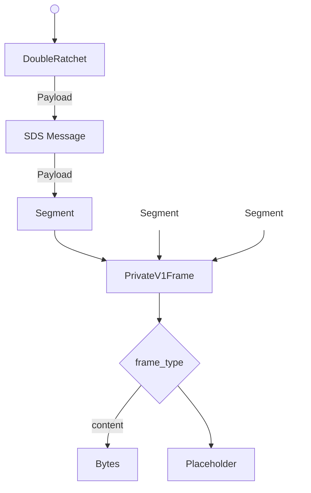

# Abstract

This specification defines PRIVATE1, a conversation protocol for establishing secure, full-duplex encrypted communication channels between two participants. PRIVATE1 provides end-to-end encryption with forward secrecy and post-compromise security using the DoubleRatchet algorithm, combined with reliable message delivery via Scalable Data Sync (SDS) and efficient segmentation for transport-constrained environments.

The protocol is transport-agnostic and designed to support both direct messaging and as a foundation for group communication systems. PRIVATE1 ensures payload confidentiality, content integrity, sender privacy, and message reliability while remaining resilient to network disruptions and message reordering.

# Background

Pairwise encrypted messaging channels represent the foundational building block upon which modern secure communication systems are constructed. While end-to-end encrypted group chats and public channels dominate user-facing features and capture the majority of user attention, the underlying infrastructure enabling these complex communication patterns relies fundamentally on secure one-to-one communication primitives. Just as higher-level network protocols are built upon reliable transport primitives like TCP, sophisticated group communication systems depend on robust pairwise channels to function correctly and securely.

These channels serve purposes beyond simple content delivery. They transmit not only user-visible messages but also critical metadata, coordination signals, and state synchronization information between clients. This signaling capability makes pairwise channels essential infrastructure for distributed systems: key material distribution, membership updates, administrative actions, and protocol coordination all flow through these channels. While more sophisticated group communication strategies can achieve better efficiency at scale—particularly for broadcast-style communication patterns with many participants—they struggle to match the privacy and security properties that pairwise channels provide inherently. The fundamental asymmetry of two-party communication enables stronger guarantees: minimal metadata exposure, simpler key management, clearer authentication boundaries, and more straightforward security analysis.

However, being encrypted is merely the starting point, not the complete solution. Production-quality one-to-one channels must function reliably in the messy reality of modern networks. Real-world deployment demands resilience to unreliable networks where messages may be lost, delayed, duplicated, or arrive out of order. Channels must efficiently handle arbitrarily large payloads—from short text messages to multi-megabyte file transfers—while respecting the maximum transmission unit constraints imposed by various transport layers. Perhaps most critically, the protocol must remain fully operational even when one or more participants are offline or intermittently connected, a common scenario in mobile environments where users move between network conditions, battery limitations force background restrictions, or time zone differences mean participants are rarely simultaneously active. These practical requirements shape the protocol design as significantly as cryptographic considerations, demanding careful attention to segmentation strategies, reliability mechanisms, state management, and resource constraints alongside the core security properties.


# Private V1

PrivateV1 is conversation type which establishes a full-duplex secure channel between two participants.

Private Conversations have the following properties:
 - Payload Confidentiality: Only the participants can read the contents of any message sent.
 - Content Integrity: Recipients can detect if the contents were modified by a third party.
 - Sender Privacy: Only the recipient can determine who the sender was.
 - Forward Secrecy: A compromise in the future does not allow previous messages to be decrypted by a third party.
 - Post Compromise Security: Conversations eventually recover from a compromise which occurs today.
 - Dropped Message Observability: Messages which were lost in transit are eventually visible to both sender and recipient.

## Definitions

This document makes use of the shared terminology defined in the [CHAT-DEFINITIONS](https://github.com/waku-org/specs/blob/jazzz/chatdefs/informational/chatdefs.md) specification.

The terms include:
- Application
- Content
- Participant
- Payload
- Recipient
- Sender


## Architecture

This conversation type assumes there is some service or application which wishes to generate and receive end-to-end encrypted content. 
It also assumes that some other component will be responsible for delivering the generated payloads. At its core this protocol takes the content provided and creates a series of payloads to be sent to the recipient.


### Content 

Content is provided to the protocol as encoded bytes. 
Due to segmentation limitations there is a restriction on the maximum size of content. 
This value is variable and is dependent upon which delivery service is used. 
In practice content size MUST be less that `255` * `max_seg_size` see: [initialization](#initialization)

Other than its size, the protocol is agnostic of content. 

### Payload Delivery

How payloads are sent and received by clients is not described in this protocol. 
The choice of delivery method has no impact on the security of this conversation type, though the choice may affect sender privacy and censorship resistance. 
In practice, any best-effort method of transmitting payloads will suffice, as no assumptions are made.


## Initialization

The channel is initialized by both sender and recipient agreeing on the following values for each conversation:
- `sk` - initial secret key  [32 bytes]
- `ssk` - sender DH seed key
- `rsk` - recipient DH seed key

To maintain the security properties:
- `sk` MUST be known only by the participants.
- `sk` MUST be derived in a way that ensures mutual authentication of the participants
- `sk` SHOULD have forward secrecy by incorporating ephemeral key material 
- `rsk` and `ssk` SHOULD incorporate ephemeral key material

Additionally implementations MUST determine the following constants:
- `max_seg_size` - maximum segmentation size to be used.
- `max_skip` - number of keys which can be skipped per session. Values are determined by 

## Frame Encoding

There are 3 phases to operation.


- **Segmentation**: Divides content into smaller fragments for transportation. 
- **Reliability**: Adds tracking information to detect dropped messages.
- **Encryption**: Provides confidentiality and tamper resistance.

The output of each phase of the operational pipeline is the input of the next.

### Segmentation
Thought the protocol has no limitation, it is assumed that a delivery mechanism MAY have restrictions on the max message size. 
While this is a transport level issue, it's included here because deferring segmentation has negative impacts on bandwidth efficiency and privacy. 
Forcing the transport layer to handle segmentation would require either reassembling unauthenticated segments (which are open to malicious interference) or implementing encryption at the transport layer.
In the event of a dropped payload, segmentation after reliability would require clients to re-broadcast entire frames, rather than only the missing segments. 
This unnecessarily increases load on the network/clients and increases a DOS attack surface. 
To optimize the entire pipeline, segmentation is handled first so that segments can benefit from the reliability and robust encryption already in place.

The segmentation strategy used is defined by [!TODO: Flatten link once completed](https://github.com/waku-org/specs/pull/91)

Implementation specifics:
- Error correction is not used, as reliable delivery is already provided by lower layers. 
- `segmentSize` = `max_seg_size` 
!TODO: ^Spec currently has a limit of 

### Message Reliability
Scalable Data Sync is used to detect missing messages and provide delivery receipts to the sender after successful reception of a payload.
SDS is implemented according to the [specification](https://github.com/vacp2p/rfc-index/blob/3505da6bd66d2830e5711deb0b5c2b4de9212a4d/vac/raw/sds.md).

!TODO: define: sender_id mapping
!TODO: define: message_id mapping
!TODO: update to latest version and include SDS-R

!NOTE: The defaultConfig in nim-SDS creates a bloom filter with the parameters n=10000, p=0.001 which has a size of ~18KiB. The bloom filter is included in every message which results in a best-case overhead rate of 13.3% (assuming waku's MSS of 150KB).
Given a target content size of 4KB, that puts the utilization factor at 80+% (Without considering other layers). 
This needs to be looked at, lowering to n=2000 would lower overhead to ~3.5 KiB.

### Encryption

Payloads are encrypted using the [doubleratchet](https://signal.org/docs/specifications/doubleratchet/) protocol.

With the following choices for external functions:
- `DH`: X25519
- `KDF_RF`: HKDF with SHA256, info = `logoschat_privatev1`
- `KDF_CK`: HKDF with SHA256, input = "0x01 for message_key, and "0x02" for chain_key
- `KDF_MK`: HKDF with SHA256, hdkf.info = "PrivateV1MessageKey"
- `ENCRYPT`: Implemented with AEAD_CHACHA20_POLY1305

!TODO: Define AssociatedData

AEAD_CHACHA20_POLY1305 is implemented using randomly generated nonces. 
The nonce and tag are combined with the ciphertext for transport where `ciphertext = nonce || encrypted_bytes || tag`.


## Frame Handling

This protocol uses explicit tagging of content, to remove ambiguity when parsing/handling frames. 
This creates a clear distinction between frames generated by the protocol, and content which was passed in.
Even if new frames are added in the future, Clients can be certain whether the payload is intended for itself or applications. 
This is achieved through an invariant - All non-content frames are intended to be consumed by the client. 
When a new unknown frame arrives it can be certain that a version compatibility issue has occurred. 

- All application level content MUST use the `content` frameType.
- Clients SHALL only pass `content` tagged frames to Applications
- Clients MAY drop unrecognized frames 


# Wire Format Specification / Syntax

## Payload Parse Tree

A deterministic parse tree is used to avoid ambiguity when receiving payloads.


!TODO: Replace placeholder 


## Payloads
!TODO: Don't duplicate payload definitions from other specs. Though its helpful for now.

### Encrypted Payload
```protobuf
message Doubleratchet {
    bytes dh = 1;               // 32 byte publickey
    uint32 msgNum = 2;          
    uint32 prevChainLen = 3;     
    bytes ciphertext = 4;       // arbitrary length bytes
}
```
**dh**: the x component of the dh_pair.publickey encoded as raw bytes. 
**ciphertext**: A protobuf encoded SDS Message

### SDS Message

This payload is used without modification from the SDS Spec.

```protobuf
message HistoryEntry {
    string message_id = 1;        
    bytes retrieval_hint = 2;                      
  }
  
message ReliablePayload {
    string message_id = 2;      
    string channel_id = 3;  
    int32 lamport_timestamp = 10;    
    repeated HistoryEntry causal_history = 11;   
    bytes bloom_filter = 12; 
    bytes content = 20;                           
  }
```

**content:** This field is an protobuf encoded `Segment`

!TODO: Why is SDS using signed int for timestamps?

### Segmentation 

This payload is used without modification from the Segmentation [specification](https://github.com/waku-org/specs/blob/fa2993b427f12796356a232c54be75814fac5d98/standards/application/segmentation.md)

```protobuf

message SegmentMessageProto {
  bytes  entire_message_hash    = 1; // 32 Bytes
  uint32 index                  = 2; 
  uint32 segments_count         = 3;
  bytes  payload                = 4; 
  uint32 parity_segment_index   = 5;
  uint32 parity_segments_count  = 6; 
}

```

**payload**: This field is an protobuf encoded `PrivateV1Frame`

!TODO: This should be encoded as a FrameType so it can be optional.

### Frame

```protobuf
message PrivateV1Frame {                 
    uint64 timestamp = 1;             // Sender reported timestamp
	oneof frame_type {
		bytes content = 10;
        Placeholder placeholder = 11;
        // ....
	}
}
```

**content:** is encoded as bytes in order to allow implementations to define the type at runtime. 


## Implementation Suggestions

### Content Types

Implementors need to be mindful of maintaining interoperability between clients, when deciding how content is encoded prior to transmission.
In a decentralized context, clients cannot be assumed to be using the same version let alone application. It is recommended that implementors use a self-describing content payload such as [CONTENTFRAME](https://github.com/waku-org/specs/blob/jazzz/content_frame/standards/application/contentframe.md) specification. This provides the ability for clients to determine support for incoming frames, regardless of the software used to receive them. 

### Initialization

Mutual authentication is provided by the `sk`, so there is no requirement of using authenticated keys for `ssk` and `rsk`. 
Implementations SHOULD use the most ephemeral key available in order incorporate as much key material as possible. 
This means that senders SHOULD generate a new ephemeral key for `ssk` for every conversation assuming channels are asynchronously initialized.

### Excessive Skipped Message 

Handling of skipped message keys is not strictly defined in double ratchet. 
Implementations need to choose an strategy which works best for their environment, and delivery mechanism. 
Halting operation of the channel is the safest, as it bounds resource utilization in the event of a DOS attack but is not always possible.  

If eventual delivery of messages is not guaranteed, implementors should regularly delete keys that are older than a given time window. 
Unreliable delivery mechanisms will result in increased key storage over time, as more messages are lost with no hope of delivery. 

!TODO: Worth making deletion of stale keys part of the spec?

## Security/Privacy Considerations

### Sender Derivation


### Segmentation Session Binding 


### Privacy - ContentSize


## Copyright

Copyright and related rights waived via [CC0](https://creativecommons.org/publicdomain/zero/1.0/).

## References

A list of references. use SHA256 or SAH256.

