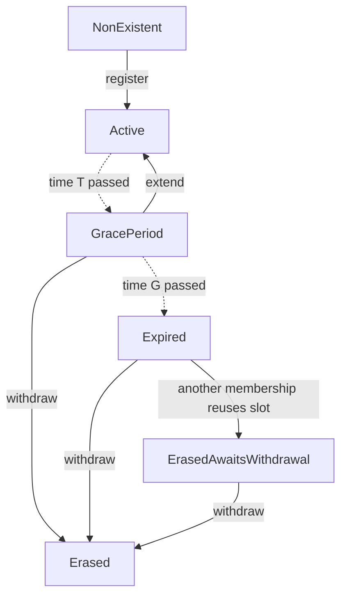

## Abstract

This document describes membership management for the RLN smart contract, in particular:
- membership-related contract functionality;
- suggested parameters valued for the initial mainnet deployment;
- contract governance and upgradability.

This document currently only considers membership-related functionality.
It might later evolve into a full-fledged contract specification.

RLN is only deployed on Sepolia testnet ([source code](https://github.com/waku-org/waku-rlnv2-contract/blob/main/src/WakuRlnV2.sol)) as of August 2024.
This document aims to outline the path to its mainnet deployment.

## Syntax

The key words “MUST”, “MUST NOT”, “REQUIRED”, “SHALL”, “SHALL NOT”, “SHOULD”, “SHOULD NOT”, “RECOMMENDED”, “NOT RECOMMENDED”, “MAY”, and “OPTIONAL” in this document are to be interpreted as described in [RFC 2119](https://www.ietf.org/rfc/rfc2119.txt).

## Background

Rate-Limiting Nullifier (RLN) is a ZK-based gadget used for privacy-preserving rate limiting in Waku.
The RLN smart contract is the core element of RLN architecture.
The smart contract stores the RLN tree that contains all currently existing memberships.
Users interact with the contract to manage their memberships
and to get the necessary data for proof generation and verification.

Sending messages is handled by Waku RLN Relay nodes.
To send a message, the sender MUST prove its validity in terms of RLN.
An RLN Relay node MUST relay a message unless it is invalid.
See [17/WAKU2-RLN-RELAY](https://github.com/vacp2p/rfc-index/blob/main/waku/standards/core/17/rln-relay.md) for the full specification of RLN Relay.

## Contract overview

The contract MUST provide the following functionalities:
- register a membership;
- extend a membership;
- withdraw a deposit.

Contract parameters and their RECOMMENDED values for the initial mainnet deployment are as follows:

| Parameter                                   | Symbol    | Value   | Units                              |
| ------------------------------------------- | --------- | ------- | ---------------------------------- |
| Epoch length                                | `epoch`   | `10`    | minutes                            |
| Maximum total rate limit of all memberships | `R_{max}` | `20000` | messages per `epoch`               |
| Minimal rate limit of one membership        | `r_{min}` | `20`    | messages per `epoch`               |
| Price of `1` message per epoch              | `p_u`     | `0.01`  | `USD` per one period of length `T` |
| Membership expiration term                  | `T`       | `180`   | days                               |
| Membership grace period                     | `G`       | `30`    | days                               |

## Membership lifecycle

Any existing membership MUST always be in exactly one of the following states:
- _Active_;
- _GracePeriod_;
- _Expired_;
- _ErasedAwaitsWithdrawal_;
- _Erased_.

State updates triggered by a transaction (e.g., from _GracePeriod_ to _Active_ as a result of `extend`) MUST be applied immediately.
State updates defined by time progression (e.g., from _GracePeriod_ to _Expired_ after time `G`) MAY be applied lazily.

When providing any membership-specific functionality, the contract MUST:
- check whether the state of the membership involved is up-to-date;
- if necessary, update the membership state;
- process the transaction in accordance with the up-to-date membership state.

Memberships MUST be included in the RLN tree according to the following table:

| State                    | Included in the RLN tree |
| ------------------------ | ------------------------ |
| _Active_                 | Yes                      |
| _GracePeriod_            | Yes                      |
| _Expired_                | Yes                      |
| _ErasedAwaitsWithdrawal_ | No                       |
| _Erased_                 | No                       |

Memberships MUST NOT be transferable.
A user MAY use one Ethereum address to manage multiple memberships.
A user MAY use one Waku node to manage multiple memberships. [^1]

[^1]: No Waku implementation supports managing multiple memberships from one node (as of August 2024).

## Contract functionalities

Availability of membership-specific functionalities MUST be as follows:

|                       | Active | GracePeriod | Expired | ErasedAwaitsWithdrawal | Erased |
| --------------------- | ------ | ----------- | ------- | ---------------------- | ------ |
| Send a message        | Yes    | Yes         | Yes     | No                     | No     |
| Extend the membership | No     | Yes         | No      | No                     | No     |
| Withdraw the deposit  | No     | Yes         | Yes     | Yes                    | No     |

Sending a message is included here for completeness,
although it is part of the RLN Relay protocol and not the RLN contract.

### Register a membership

Membership registration is subject to the following conditions:
- if there are _Expired_ memberships in the RLN tree, the new membership MUST overwrite an _Expired_ membership;
- the new membership SHOULD overwrite the membership that had been _Expired_ for the longest time;
- if a new membership A overwrites an _Expired_ membership B:
	- membership B MUST become _ErasedAwaitsWithdrawal_;
	- the current total rate limit MUST be decremented by the rate limit of membership B;
	- the contract MUST take all necessary steps to ensure that the holder of membership B can withdraw their deposit later;
- registration MUST fail if the total rate limit of _Active_, _GracePeriod_, and _Expired_ memberships, including the one being created, would exceed the maximum total rate;
- registration MUST fail if the requested rate limit for a new membership is lower than the minimal allowed rate limit;
- the user MUST lock-up a deposit to register a membership;
- the user MUST specify the rate limit of the new membership[^2];
- the size of the deposit MUST depend on the requested rate limit;
- in case of a successful registration:
	- the new membership MUST become _Active_;
	- the current total rate limit MUST be incremented by the rate limit of the new membership;
- a newly created membership MUST have an expiration time `T` and a grace period `G`.

[^2]: A user-facing application SHOULD suggest default values for rate limits for the user.

### Extend a membership

Extending a membership is subject to the following conditions:
- extension MUST fail if the membership is in any state other than _GracePeriod_;
- the membership holder MUST be able to extend their membership;
- any user except the membership holder MUST NOT be able to extend a membership;
- after a successful extension, the membership MUST become _Active_.

Holding a membership means controlling the private key from which the RLN commitment ID (i.e., public key) was derived.

### Withdraw the deposit

Deposit withdrawal is subject to the following conditions:
- the membership holder MUST be able to withdraw their deposit;
- any user except the membership holder MUST NOT be able to withdraw its deposit;
- a deposit MUST be withdrawn in full;
- a withdrawal MUST fail if the membership is not in _GracePeriod_, _Expired_, or _ErasedAwaitsWithdrawal_;
- a membership MUST become _Erased_ after withdrawal.

## Governance and upgradability

At initial mainnet deployment, the contract MUST have an _Owner_.
The _Owner_ MUST be able to change the values of all contract parameters.
The _Owner_ MUST be able to pause any of the following contract functionalities:
- register a membership;
- extend a membership;
- withdraw a deposit.

At some point, the _Owner_ SHOULD renounce their privileges, and the contract MUST become immutable.
Further upgrades, if necessary, SHOULD be done by deploying a new contract and migrating the membership set.

## Implementation Suggestions

User-facing application SHOULD suggest a few rate limits (tiers) to simplify their users' choice.
The RECOMMENDED rate limits in a three-tier model are as follows:
- `20` messages per epoch as low-tier;
- `200` messages per epoch as mid-tier;
- `600` messages per epoch as high-tier.
Users SHOULD be able to select a custom rate limit under advanced settings.

The RECOMMENDED pricing parameters are:

| Parameter          | Value  |
| ------------------ | ------ |
| Accepted tokens    | `DAI`  |
| Reference currency | `USD`  |
| Pricing function   | linear |

User-facing applications SHOULD save membership expiration dates in a local keystore during registration,
and notify the user when their membership is about to expire.

## Q&A

### Why can't I withdraw a deposit from an _Active_ membership?

The rationale for this limitation is to prevent an undesirable usage pattern where users make deposits and withdrawals in short succession.

### Why can't I extend an _Active_ membership?

Memberships can only be extended during _GracePeriod_.
We do not allow extending an _Active_ membership.
The rationale is that if the contract _Owner_ changes some contract parameters (e.g., for security purposes),
users with extended memberships will not be affected by the changes for a long time.

### What if I don't extend my membership within its _GracePeriod_?

The user who does not extend their _GracePeriod_ membership, 
assume the risk of the membership being overwritten at any moment.
We expect, generally, that a user would not want to take that risk 
and would either extend their membership or withdraw their deposit.

### Can I send messages when my membership is _Expired_?

An _Expired_ membership allows sending messages for some time.
Sending messages is managed by RLN Relay nodes.
The RLN proof that message senders provide to RLN Relay nodes doesn't prove the state of that membership.

_Expired_ memberships are not erased from the tree proactively.
An _Expired_ membership is only erased when either a new membership overwrites it,
or when its deposit is withdrawn.
After a membership is erased, it can no longer be used for sending messages.

### Will my deposit be slashed if I exceed the rate limit?

This specification does not involve slashing.
The aim of the deposit initially is to protect the network from denial-of-service attacks with bandwidth capping.

### Do I need an extra deposit to extend a membership?

Membership extension requires no additional deposit.
The opportunity cost of locked-up capital plus gas fees for extension transactions make extensions non-free, which is sufficient for the initial mainnet deployment.

### Why this particular epoch length?

Epoch length is a global parameter set in the smart contract.
Rate limits are defined in terms of the maximum allowed messages per epoch.
There is a trade-off between short and long epochs.
We chose an epoch length of `10` minutes as a reasonable middle-ground.

On the one hand, longer epochs allow for better accommodating short-term usage peaks.
On the other hand, long epochs increases memory requirements for RLN Relay nodes.

Each message contains a nullifier that proves its validity in terms of RLN.
Each RLN Relay node must keep in memory a nullifier log for the current epoch.
Each nullifier plus metadata is `128` bytes (per message).
With a `10`-minute epoch, one high-tier user with a `1` message per second rate limit generates up to `600 * 128 / 1024 = 75 KiB` of nullifier log data per epoch.
This corresponds to:
- for 1000 users: approximately `73 MiB`;
- for 10 thousand users: approximately `732 MiB`.

### Why is there a cap on the total rate limit?

Total network bandwidth is a limited resource.
We want to cap the total rate limit, at least in the initial mainnet deployment, to avoid overstretching the network's capabilities.

### Why is there a minimal rate limit?

The minimal rate limit prevents an attack where someone registers a large number of memberships with a tiny rate limit each, causing the RLN tree to contain too many elements.

### Are there bulk discounts for high-rate memberships?

For the initial mainnet deployment, there are no bulk discounts.
Membership price is linearly proportional to its rate limit.
We choose this pricing scheme for simplicity.
Finding a pricing scheme with the right trade-off remains subject for future work, as
high-rate memberships are arguably more efficient but can incentivize centralization.

### Why only accept DAI?

When choosing a token to accept, we considered the following criteria:
- a stablecoin, as USD-denominated pricing is familiar for users and requires no oracle;
- popular, high liquidity;
- preferably decentralized;
- with a reasonably good anti-censorship track record.

Based on these criteria, we chose DAI for the initial mainnet deployment.
Other tokens may be added in the future.

## Security / Privacy Considerations

Issuing membership-specific transactions (e.g., membership extension and deposit withdrawal) publicly links it to an Ethereum address.
Note that this does not degrade the privacy of the relayed messages,
as message validation doesn't require the sender to disclose which membership they hold.

To produce an RLN proof, a message sender must obtain a Merkle proof that their membership belongs to the RLN tree.
One way to obtain this proof is to request it from the smart contract itself.
Requesting a proof through a third-party RPC provider may endanger the sender's privacy.
The provider would be able to link the requester's Ethereum address and the RLN membership with the corresponding API key.

## Copyright

Copyright and related rights waived via [CC0](https://creativecommons.org/publicdomain/zero/1.0/).

## References

- [Rate-Limiting Nullifier](https://rate-limiting-nullifier.github.io/rln-docs/)
- [11/WAKU2-RELAY](https://github.com/vacp2p/rfc-index/blob/main/waku/standards/core/11/relay.md)
- [17/WAKU2-RLN-RELAY](https://github.com/vacp2p/rfc-index/blob/main/waku/standards/core/17/rln-relay.md)

