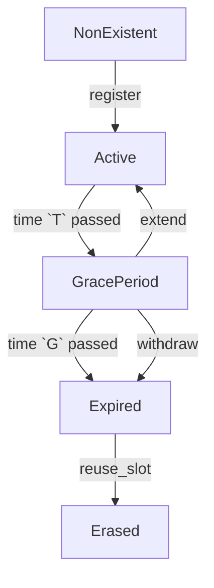

## Abstract

This document specifies RLN membership management in the context of mainnet deployment of the RLN smart contract, in particular:
- membership-related contract functionality;
- contract parameters for the initial mainnet deployment;
- contract governance and upgradability.

We only consider contract functionality relevant for membership management.
The document might later evolve into a full-fledged contract specification.

## Background

Rate-Limiting Nullifier (RLN) is a ZK-based gadget used in Waku.
RLN provides a privacy-preserving way to limit each user's burden on the network.
The RLN smart contract is the core element of RLN architecture.
Users interact with the contract to manage their memberships,
as well as to get the data necessary for proof generation and verification.

To relay a message:
- the sender MUST register a membership in a smart contract;
- the sender MUST attach a ZK-proof of membership to every message;
- each relaying node MUST drop the message if:
	- the proof is invalid; or
	- the sender has exceeded their rate limit within the current epoch.

RLN is only deployed on Sepolia testnet as of August 2024.
This document aims to outline the path to its mainnet deployment.

## Membership lifecycle

Any existing membership MUST always be in exactly one of the following states:
- active;
- grace-period;
- expired;
- erased.

State updates triggered by a transaction MUST be updated immediately.
State updates defined by time progression MAY be updated lazily.
Before providing any membership-specific functionality, the contract MUST:
- check whether the state of the membership involved is up-to-date;
- if necessary, update the membership state;
- process the transaction in accordance with the up-to-date membership state.

Memberships MUST NOT be transferable.
One Ethereum address MAY register multiple memberships.
One Waku node MAY manage multiple memberships (this functionality is not yet implemented as of August 2024).

## Contract functionalities

The contract MUST provide the following functionalities:
- register a membership;
- extend a membership;
- withdraw a deposit.

Availability of membership-specific functionalities MUST be as follows:

|                       | Active | Grace Period | Expired | Erased |
| --------------------- | ------ | ------------ | ------- | ------ |
| Send a message        | Yes    | Yes          | Yes     | No     |
| Extend the membership | No     | Yes          | No      | No     |
| Withdraw the deposit  | No     | Yes          | Yes     | Yes    |
### Governance and upgradability

At initial mainnet deployment, the contract MUST have an _Owner_ with the following additional functionalities:
- change any of the modifiable parameters, as listed in the Parameter table;
- disable any of the following contract functionalities:
	- register a membership;
	- extend a membership;
	- (TBD) withdraw a deposit.

At some point, the _Owner_ SHOULD renounce their privileges, and the contract MUST become immutable.
Further upgrades, if necessary, SHOULD be done by deploying a new contract and migrating the membership set.

### Register a membership

Membership registration is subject to the following conditions:
- if there are _expired_ memberships in the contract, the new membership MUST overwrite an expired membership;
- the new membership SHOULD overwrite the membership that had been in _expired_ state for the longest time;
- if the new membership overwrites another membership, the latter MUST transition from _expired_ to _erased_ state;
- if the deposit from the newly _erased_ membership has not been withdrawn, the contract MUST take all necessary steps to ensure that the owner of that membership can withdraw their deposit later;
- registration MUST fail if the total rate limit of _active_, _grace-period_, and _expired_ memberships, including the one being created, would exceed the limit;
- registration MUST fail if the requested rate limit for the new membership is lower than allowed;
- the user MUST lock-up a deposit to register a membership;
- the user MUST specify the requested rate limit of the new membership;
- the size of the deposit MUST be calculated depending on the requested rate limit;
- in case of successful registration, the new membership MUST be in _active_ state;
- a newly created membership MUST have an expiration time `T` and a grace period `G` (suggested values listed below).

### Send a message

Sending messages is handled by Waku Relay nodes, not by the RLN smart contract.
For completeness, sending messages is mentioned below where relevant as one of broader Waku functionalities.
The full specification of Relay node behavior is out of scope for this document.

A Relay node MUST relay a message unless:
- the message is committed to a different epoch than the current epoch; or
- the user has exceed their allowed rate limit for the current epoch; or
- the RLN proof fails to prove that the message sender owns an existing membership.

### Extend a membership

Extending a membership is subject to the following condition:
- extension MUST fail if the membership is in any state other than _grace-period_;
- the membership owner MUST be able to extend the membership;
- any user except the membership owner MUST NOT be able to extend the membership;
- after a successful extension, the membership MUST become _active_.

Owning a membership means controlling the private key from which the RLN commitment ID (i.e., public key) was derived.

### Withdraw the deposit

Deposit withdrawal is subject to the following conditions:
- the owner of a membership MUST be able to withdraw their deposit;
- a deposit MUST be withdrawn in full;
- any user except the membership owner MUST NOT be able to withdraw its deposit;
- a withdrawal MUST fail if the membership is in any state other than _grace-period_, _expired_, or _erased_;
- a withdrawal from a _grace-period_ membership MUST move it into the _expired_ state;
- a withdrawal from an _expired_ membership MUST NOT change its state (TBD);
- a withdrawal from an _erased_ membership MUST NOT change its state (TBD).

## Implementation Suggestions

The current version of the contract (RLNv2) is deployed on Sepolia testnet ([source code](https://github.com/waku-org/waku-rlnv2-contract/blob/main/src/WakuRlnV2.sol)).

The RECOMMENDED parameter values for the initial mainnet deployment are listed in the following table.
All parameter values MUST be modifiable by the contract _Owner_.

| Parameter                                   | Symbol    | Value   | Units                              |
| ------------------------------------------- | --------- | ------- | ---------------------------------- |
| Epoch length                                | `epoch`   | `10`    | minutes                            |
| Maximum total rate limit of all memberships | `R_{max}` | `20000` | messages per `epoch`               |
| Minimal rate limit of one membership        | `r_{min}` | `20`    | messages per `epoch`               |
| Price of `1` message per epoch              | `p_u`     | `0.01`  | `USD` per one period of length `T` |
| Membership expiration term                  | `T`       | `90`    | days                               |
| Membership grace period                     | `G`       | `30`    | days                               |
| Accepted tokens                             |           | `DAI`   |                                    |
| Reference currency                          |           | `USD`   |                                    |
| Pricing function                            |           | linear  |                                    |

Applications MAY suggest the following rate limits to their users:
- `20` messages per epoch as low-tier;
- `200` messages per epoch as mid-tier;
- `600` messages per epoch as high-tier.

## Q&A

### Why can't I withdraw a deposit from an _active_ membership?

The rationale for this limitation is to prevent an undesirable usage pattern where users make deposits and withdrawals in short succession.

### Why can't I extend an active membership?

We do not allow extending an _active_ membership.
The rationale here is that if the _Owner_ changes some contract parameters (e.g., for security purposes),
users with extended memberships will not be affected by the changes for a long time.

### What happens if I don't extend my membership during its grace period?

The user who does not extend their membership during its grace period, assumes the risk of the membership being overwritten (and therefore _erased_) at any moment.
We expect that most honest users would not want to take that risk and would either extend their memberships or withdraw their deposits during the grace period.

TBD: should we make membership _erased_ immediately on deposit withdrawal?

### Can I send messages after my membership expires?

A membership allows sending messages for some time after expiry.

Sending messages is managed by Relay nodes, not by RLN contract.
The RLN proof that message senders provide to Relay nodes only proves whether the sender owns _some_ membership included in the RLN tree.
The sender cannot prove the state of that membership.

_Expired_ memberships are not erased from the tree proactively,
as this would require someone to send a transaction and pay the gas costs.
Instead, an _expired_ membership is only _erased_ when a new memberships overwrites it.

### Will my deposit be slashed if I exceed the rate limit?

The aim of the deposit initially is to protect the network from denial-of-service attacks with bandwidth capping.
The current version of RLN does not involve slashing.

### Do I need an extra deposit to extend a membership?

Membership extension requires no additional deposit.
The opportunity cost of locked-up capital plus gas fees for extension transactions make extensions non-free, which is sufficient for the initial mainnet deployment.

### Why this particular epoch length?

Epoch length is a global parameter set in the smart contract.
Rate limits are defined in terms of the maximum allowed messages per epoch.
There is a trade-off between short and long epochs.

On the one hand, longer epochs allow for better accommodating short-term usage peaks.
Peaks tend to average out over longer time periods,
which allows us to reason about network utilization on a longer time scale.

On the other hand, long epochs increases memory requirements for Relay nodes.
Each message contains a nullifier that proves its validity in terms of RLN.
Each Relay node must keeps in memory a nullifier log for the current epoch.

We chose an epoch length of `10` minutes as a reasonable middle-ground.
Each nullifier plus metadata is `128` bytes (per message).
With a `10`-minute epoch, one high-tier user with a `1` message per second rate limit generates up to `600 * 128 / 1024 = 75 KiB` of nullifier log data per epoch.
This corresponds to:
- for 1000 users: approximately `73 MiB`;
- for 10 thousand users: approximately `732 MiB`.

### Why is there a cap on the total rate limit?

Total network bandwidth is a limited resource.
We want to cap the total rate limit, at least in the initial mainnet deployment, to avoid overstretching the network's capabilities.

### Why is there a minimal rate limit?

The minimal rate limit prevents an attack where someone registers a large number of memberships with a tiny rate limit each, causing the RLN tree to contain too many elements.

### Are there bulk discounts for high-rate memberships?

For the initial mainnet deployment, membership price is linearly proportional to its rate limit.
We choose this pricing scheme for simplicity.
In other words, there are no bulk discounts.
High-rate memberships are arguably more efficient but can incentivize centralization.
Finding a pricing scheme with the right trade-off remains subject for future work.

### Why only accept DAI?

When choosing a token to accept, we considered the following criteria:
- a stablecoin, as USD-denominated pricing is familiar for users and requires no oracle;
- popular, high liquidity;
- preferably decentralized;
- with a reasonably good track record w.r.t. censorship.

Based on these criteria, we chose DAI for the initial mainnet deployment.
Other tokens may be added in the future.

## Security / Privacy Considerations

Issuing membership-specific transactions (e.g., membership extension and deposit withdrawal) publicly links it to an Ethereum address.
Note that this does not degrade the privacy of the relayed messages.

To produce an RLN proof, a message sender must obtain a Merkle proof for their RLN membership.
One way to obtain this proof is to request it from the RLN smart contract.
Requesting a proof through a third-party RPC provider may endanger the sender's privacy.
The provider would be able to link the requester's Ethereum address and the RLN membership with the corresponding API key.

## Copyright

Copyright and related rights waived via [CC0](https://creativecommons.org/publicdomain/zero/1.0/).

## References

- [Rate-Limiting Nullifier](https://rate-limiting-nullifier.github.io/rln-docs/)
- [11/WAKU2-RELAY](https://github.com/vacp2p/rfc-index/blob/main/waku/standards/core/11/relay.md)
- [17/WAKU2-RLN-RELAY](https://github.com/vacp2p/rfc-index/blob/main/waku/standards/core/17/rln-relay.md)

---

