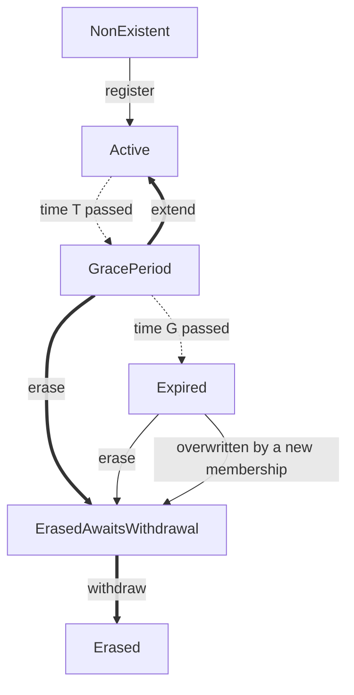

## Abstract

This document describes membership management within the RLN smart contract, specifically addressing:
- membership-related contract functionality;
- suggested parameter values for the initial mainnet deployment;
- contract governance and upgradability.

Currently, this document focuses solely on membership-related functionality.
It might later evolve into a comprehensive contract specification.

As of August 2024, RLN is deployed only on Sepolia testnet ([source code](https://github.com/waku-org/waku-rlnv2-contract/blob/main/src/WakuRlnV2.sol)).
This document aims to outline the path to its mainnet deployment.

## Syntax

The key words “MUST”, “MUST NOT”, “REQUIRED”, “SHALL”, “SHALL NOT”, “SHOULD”, “SHOULD NOT”, “RECOMMENDED”, “NOT RECOMMENDED”, “MAY”, and “OPTIONAL” in this document are to be interpreted as described in [RFC 2119](https://www.ietf.org/rfc/rfc2119.txt).

## Background

Rate-Limiting Nullifier (RLN) is a Zero-Knowledge (ZK) based gadget used for privacy-preserving rate limiting in Waku.
The RLN smart contract (referred to as "the contract" hereinafter) is the central component of the RLN architecture.
The contract stores the membership set, which contains all current memberships.
Users interact with the contract to manage their memberships
and obtain the necessary data for proof generation and verification.

Message transmission is handled by Waku RLN Relay nodes.
The sender of a message MUST prove its validity according to RLN requirements.
RLN Relay nodes MUST NOT relay invalid messages.
For the full specification of RLN Relay, see See [17/WAKU2-RLN-RELAY](https://github.com/vacp2p/rfc-index/blob/main/waku/standards/core/17/rln-relay.md).

## Contract overview

Let us define membership-related functionalities (hereinafter, functionalities) as follows:
- register a membership;
- extend a membership;
- erase a membership;
- withdraw a deposit.

The contract MUST provide the functionalities.

A membership _holder_ is the entity that controls the secret associated with the respective RLN commitment.
A membership _keeper_ is the sender (`msg.sender` in Solidity semantics) of the transaction that registered that membership.
The holder and the keeper MAY be different entities for the same membership.
When authorizing membership-related requests,
the contract SHOULD distinguish between the keeper and non-keepers,
and MAY also use additional criteria.

The contract MUST support transactions sent directly from externally-owned accounts (EOA).
The contract MAY support transactions sent via a chain of contract calls,
in which case the last contract in the call chain MAY be designated as the membership keeper.
The contract MAY also support meta-transactions sent via paymasters or relayers,
which MAY require additional authentication-related logic.

Contract parameters and their RECOMMENDED values for the initial mainnet deployment are as follows:

| Parameter                                                         | Symbol    | Value    | Units              |
| ----------------------------------------------------------------- | --------- | -------- | ------------------ |
| Epoch length                                                      | `t_{ep}`  | `600`    | seconds            |
| Maximum total rate limit of all memberships in the membership set | `R_{max}` | `160000` | messages per epoch |
| Minimum rate limit of one membership                              | `r_{min}` | `20`     | messages per epoch |
| Maximum rate limit of one membership                              | `r_{max}` | `600`    | messages per epoch |
| Membership expiration term                                        | `T`       | `180`    | days               |
| Membership grace period duration                                           | `G`       | `30`     | days               |
| Membership price for `1` message per epoch for period `T`         | `p_u`     | `0.05`   | `USD`              |
| Accepted tokens                                                   |           | `DAI`    |                    |

The pricing function SHOULD be linear in the rate limit per epoch.

Note: epoch length means the same as `period` as defined in [17/WAKU2-RLN-RELAY](https://github.com/vacp2p/rfc-index/blob/main/waku/standards/core/17/rln-relay.md).
This specification uses the term "epoch length" instead of "period" to avoid confusion with "grace period".

## Membership lifecycle

Any existing membership MUST always be in exactly one of the following states:
- _Active_;
- _GracePeriod_;
- _Expired_;
- _ErasedAwaitsWithdrawal_;
- _Erased_.



Different line types denote the types of state transitions:

| Line type      | Triggered by     | Requirements                                                                         |
| -------------- | ---------------- | ------------------------------------------------------------------------------------ |
| Thick (`==`)   | Transaction      | MUST be initiable by the membership keeper and MUST NOT be initiable by other users. |
| Thin (`--`)    | Transaction      | MAY be initiable by any user.                                                        |
| Dotted (`-.-`) | Time progression | MAY be applied lazily.                                                               |

Transaction-triggered state transitions MUST be applied immediately.

When handling a membership-specific transaction, the contract MUST:
- check whether the state of the involved membership is up-to-date;
- if necessary, update the membership state;
- process the transaction in accordance with the updated membership state.

Memberships MUST be included in the membership set according to the following table:

| State                    | Included in the membership set |
| ------------------------ | ------------------------ |
| _Active_                 | Yes                      |
| _GracePeriod_            | Yes                      |
| _Expired_                | Yes                      |
| _ErasedAwaitsWithdrawal_ | No                       |
| _Erased_                 | No                       |

Memberships MUST NOT be transferable.
A user MAY use one Ethereum address to manage multiple memberships.
A user MAY use one Waku node[^1] to manage multiple memberships.

[^1]: No Waku implementation supports managing multiple memberships from one node (as of August 2024).


## Contract functionalities

Availability of functionalities[^2] MUST be as follows:

|                       | Active | GracePeriod       | Expired | ErasedAwaitsWithdrawal | Erased |
| --------------------- | ------ | ----------------- | ------- | ---------------------- | ------ |
| Extend the membership | No     | Yes (keeper only) | No      | No                     | No     |
| Erase the membership  | No     | Yes (keeper only) | Yes     | No                     | No     |
| Withdraw the deposit  | No     | No                | No      | Yes (keeper only)      | No     |

[^2]: Sending a message is not present in this table because it is part of the RLN Relay protocol and not the contract. For completeness, we note that the membership holder MUST be able to send a message if their membership is _Active_, in _GracePeriod_, or _Expired_. Sending messages with _Expired_ memberships is allowed, because the inclusion (Merkle) proof that the holder provides to RLN Relay only proves that the membership belongs to the membership set, and not that membership's state.

### Register a membership

Membership registration is subject to the following requirements:
- The keeper MUST specify the requested rate limit  `r` of a new membership at registration time[^3].
- Registration MUST fail if `r < r_{min}` or `r > r_{max}`.
- The keeper MUST lock up a deposit to register a membership.
- The size of the deposit MUST depend on the specified rate limit.
- In case of a successful registration:
	- the new membership MUST become _Active_;
	- the new membership MUST have an expiration term `T` and a grace period duration `G`;
	- the current total rate limit MUST be incremented by the rate limit of the new membership.
#### Overwriting other memberships

Let us define the following rate limits:
- `R_{active}` is the total rate limit of all _Active_ memberships;
- `R_{grace_period}` is the total rate limit of all _GracePeriod_ memberships;
- `R_{expired}` is the total rate limit of all _Expired_ memberships.

Let us define the free rate limit that is available without overwriting _Expired_ memberships as follows:

```
R_{free} = R_{max} - R_{active} - R_{grace_period} - R_{expired}
```

Membership registration is additionally subject to the following requirements:
- If `r <= R_{free}`, the new membership MUST be registered (assuming all other necessary conditions hold). The new membership MAY overwrite one or multiple _Expired_ memberships.
- If `r > R_{free}`:
	- if `r > R_{free} + R_{expired}`, registration MUST fail;
	- if `r <= R_{free} + R_{expired}`, the new membership MUST be registered by overwriting some _Expired_ memberships.
- The sender of the registration transaction MAY specify a list of _Expired_ memberships to be overwritten. If the list is not provided, the contract MAY use any criteria to select _Expired_ memberships to overwrite (see Implementation Suggestions).
- If a new membership A overwrites an _Expired_ membership B:
	- membership B MUST become _ErasedAwaitsWithdrawal_;
	- the current total rate limit MUST be decremented by the rate limit of membership B;
	- the contract MUST take all necessary steps to ensure that the keeper of membership B can withdraw their deposit later.

[^3]: A user-facing application SHOULD suggest default rate limits to the keeper (see Implementation Suggestions).

### Extend a membership

Extending a membership is subject to the following conditions:
- The extension MUST fail if the membership is in any state other than _GracePeriod_.
- The membership keeper MUST be able to extend their membership.
- Any user other than the membership keeper MUST NOT be able to extend a membership.
- After a successful extension, the membership MUST become _Active_.

### Withdraw the deposit

Deposit withdrawal is subject to the following conditions:
- The membership keeper MUST be able to withdraw their deposit.
- Any user other than the membership keeper MUST NOT be able to withdraw its deposit.
- A deposit MUST be withdrawn in full.
- A withdrawal MUST fail if the membership is not in _ErasedAwaitsWithdrawal_.
- A membership MUST become _Erased_ after withdrawal.

## Governance and upgradability

At initial mainnet deployment, the contract MUST have an _Owner_.
The _Owner_ MUST be able to change the values of all contract parameters.
The updated parameter values MUST apply to all new memberships.
The parameters of existing memberships MUST NOT change if the _Owner_ updates global parameters.
The contract MAY restrict extensions for memberships created before the latest parameter update.

The _Owner_ MUST be able to pause any of the functionalities (see definition above).

At some point, the _Owner_ SHOULD renounce their privileges,
and the contract MUST become immutable.
If further upgrades are necessary,
a new contract SHOULD be deployed,
and the membership set SHOULD be migrated.

## Implementation Suggestions

### Membership Set Implementation

The membership set MAY be implemented as a Merkle tree, such as an [Incremental Merkle Tree](https://zkkit.pse.dev/modules/_zk_kit_imt.html) (IMT).

### Choosing Which _Expired_ Memberships to Overwrite

When registering a new membership, the contract needs to decide which _Expired_ memberships, if any, to overwrite.
The criteria for this selection can vary depending on the implementation.

Key considerations include:
- To minimize gas costs, it's better to overwrite a single high-rate membership rather than multiple low-rate ones.
- To encourage timely deposit withdrawals, it's better to overwrite memberships that have been _Expired_ for a long time.

### Considerations for User-facing Applications

User-facing applications SHOULD suggest one or more rate limits (tiers) to simplify user selection among the following RECOMMENDED options:
- `20` messages per epoch as low-tier;
- `200` messages per epoch as mid-tier;
- `600` messages per epoch as high-tier.

User-facing applications SHOULD save membership expiration dates in a local keystore during registration,
and notify the user when their membership is about to expire.

## Q&A

### Why can't I withdraw a deposit from an _Active_ membership?

The rationale for this limitation is to prevent a usage pattern where users make deposits and withdrawals in quick succession.  
Such a pattern could lead to network instability and should be carefully considered if deemed desirable.

### Why can't I extend an _Active_ membership?

Memberships can only be extended during _GracePeriod_.
Extending an _Active_ membership is not allowed.
The rationale is to make possible parameter changes that the contract _Owner_ might make (e.g., for security reasons) applicable to most memberships.

### What if I don't extend my membership within its _GracePeriod_?

If the membership is not extended during its _GracePeriod_,
it becomes _Expired_ and can be overwritten.  
Users are expected to either extend their membership on time to avoid this risk,
or erase them and withdraw their deposit.

### Can I send messages when my membership is _Expired_?

An _Expired_ membership allows sending messages for a certain period.
The RLN proof that message senders provide to RLN Relay nodes does not prove the state of the membership,
only its inclusion in the membership set.

_Expired_ memberships are not proactively erased from the membership set.  
An _Expired_ membership is erased only when a new membership overwrites it or when its deposit is withdrawn.  
Once in _Erased_ or _ErasedAwaitsWithdrawal_ state, the membership can no longer be used to send messages.

### Will my deposit be slashed if I exceed the rate limit?

This specification does not include slashing.
The deposit's current purpose is purely to protect the network from denial-of-service attacks through bandwidth capping.

### Do I need an extra deposit to extend my membership?

Membership extension requires no additional deposit.
The opportunity cost of locked-up capital and gas fees for extension transactions make extensions non-free,
which is sufficient for the initial mainnet deployment.

### Why this particular epoch length?

Epoch length is a global parameter defined in the contract.
Rate limits are defined in terms of the maximum allowed messages per epoch.

There is a trade-off between short and long epochs.
Longer epochs accommodate short-term usage peaks better,
but they increase memory requirements for RLN Relay nodes.
An epoch length of `10` minutes was chosen as a reasonable middle ground.

Each message contains a nullifier that proves its validity in terms of RLN.
Each RLN Relay node must store a nullifier log for the current epoch in memory.
A nullifier plus metadata is `128` bytes per message.
With a `10`-minute epoch, a high-tier user with a `1` message per second rate limit generates up to `600 * 128 / 1024 = 75 KiB` of nullifier log data per epoch.
This equates to, approximately:
- `73 MiB` for 1000 users;
- `732 MiB` for 10 thousand users.

### Why is there a cap on the total rate limit?

Total network bandwidth is a limited resource.
To avoid overstretching the network's capabilities for the initial mainnet deployment,
we define a cap `R_{max}` on the total rate limit.

### Why is there a minimum rate limit?

The minimum rate limit `r_{min}` prevents an attack where a large number of tiny memberships cause membership set bloat.

### Why is there a maximum rate limit?

The maximum rate limit `r_{max}` prevents any single actor from consuming an excessive portion of the total available rate limit.

However, it is still possible for an attacker to register multiple Ethereum addresses,
and occupy a significant portion of the total rate limit through several memberships.

### Are there bulk discounts for high-rate memberships?

For the initial mainnet deployment, no bulk discounts are offered.
Membership price is linearly proportional to its rate limit.
We choose this pricing scheme for simplicity.
Future work may explore alternative pricing schemes that balance efficiency with centralization risk.

### Why only accept DAI?

When choosing a token to accept, we considered the following criteria:
- a stablecoin, as USD-denominated pricing is familiar for users and requires no oracle;
- popular with high liquidity;
- decentralized;
- reasonably good censorship-resistance.

Based on these criteria, we chose DAI for the initial mainnet deployment.
Other tokens may be added in the future.

## Security / Privacy Considerations

Issuing membership-specific transactions,
such as membership extensions and deposit withdrawals,
publicly associates a membership with an Ethereum address.
However, this association does not compromise the privacy of the relayed messages,
as the protocol does not require the sender to disclose their specific membership to RLN Relay nodes.

To generate an RLN proof, a message sender must obtain a proof that their membership belongs to the membership set.
This proof can be requested directly from the contract.
Requesting the proof through a third-party RPC provider could compromise the sender's privacy,
as the provider might link the requester's Ethereum address, their RLN membership, and the corresponding API key.

## Copyright

Copyright and related rights waived via [CC0](https://creativecommons.org/publicdomain/zero/1.0/).

## References

- [Rate-Limiting Nullifier](https://rate-limiting-nullifier.github.io/rln-docs/)
- [11/WAKU2-RELAY](https://github.com/vacp2p/rfc-index/blob/main/waku/standards/core/11/relay.md)
- [17/WAKU2-RLN-RELAY](https://github.com/vacp2p/rfc-index/blob/main/waku/standards/core/17/rln-relay.md)


